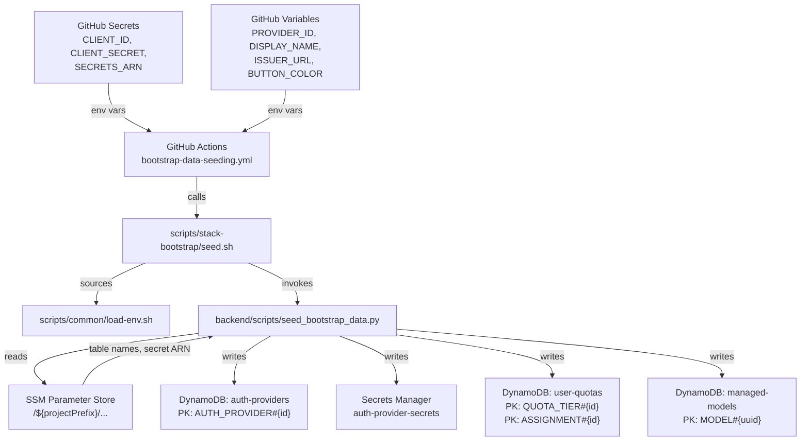

# Design Document: Bootstrap Data Seeding

## Overview

This feature replaces the manual post-deployment setup process with an automated, CI/CD-driven bootstrap data seeding pipeline. After infrastructure and App API stacks are deployed, a GitHub Actions workflow invokes a unified Python seed script (`backend/scripts/seed_bootstrap_data.py`) via shell wrappers in `scripts/stack-bootstrap/`. The script writes seed data to three DynamoDB tables and one Secrets Manager secret, resolving resource names from SSM Parameter Store.

The design follows the project's established patterns:
- **Shell Scripts First**: Workflow YAML calls scripts in `scripts/stack-bootstrap/`; no inline logic.
- **SSM for resource discovery**: Table names and secret ARNs resolved at runtime via `/${projectPrefix}/...` parameters.
- **GitHub secrets/variables**: Sensitive auth provider config from secrets; non-sensitive from variables.
- **Idempotent writes**: Check-before-write with `attribute_not_exists` conditions or get-then-skip logic.

## Architecture



## Components and Interfaces

### 1. GitHub Actions Workflow (`bootstrap-data-seeding.yml`)

Thin orchestration layer. Supports `workflow_dispatch` with environment input. Reads auth provider config from GitHub secrets (sensitive) and variables (non-sensitive). Delegates all logic to `scripts/stack-bootstrap/seed.sh`.

**Environment variables passed to seed.sh:**

| Variable | Source | Required | Description |
|---|---|---|---|
| `SEED_AUTH_PROVIDER_ID` | `vars.SEED_AUTH_PROVIDER_ID` | No | Provider slug (e.g., `entra-id`) |
| `SEED_AUTH_DISPLAY_NAME` | `vars.SEED_AUTH_DISPLAY_NAME` | No | Login page display name |
| `SEED_AUTH_ISSUER_URL` | `vars.SEED_AUTH_ISSUER_URL` | No | OIDC issuer URL |
| `SEED_AUTH_CLIENT_ID` | `secrets.SEED_AUTH_CLIENT_ID` | No | OAuth client ID |
| `SEED_AUTH_CLIENT_SECRET` | `secrets.SEED_AUTH_CLIENT_SECRET` | No | OAuth client secret |
| `SEED_AUTH_BUTTON_COLOR` | `vars.SEED_AUTH_BUTTON_COLOR` | No | Hex color for login button |
| `CDK_PROJECT_PREFIX` | `vars.CDK_PROJECT_PREFIX` | Yes | SSM parameter prefix |
| `CDK_AWS_REGION` | `vars.AWS_REGION` | Yes | AWS region |

Auth provider seeding is skipped if `SEED_AUTH_ISSUER_URL`, `SEED_AUTH_CLIENT_ID`, or `SEED_AUTH_CLIENT_SECRET` are not set.

### 2. Shell Scripts (`scripts/stack-bootstrap/`)

| Script | Purpose |
|---|---|
| `install.sh` | Installs Python dependencies (`boto3`, `httpx`) |
| `seed.sh` | Sources `load-env.sh`, resolves SSM parameters, invokes `seed_bootstrap_data.py` |

`seed.sh` resolves the following from SSM before invoking the Python script:
- `/${projectPrefix}/auth/auth-providers-table-name`
- `/${projectPrefix}/auth/auth-provider-secrets-arn`
- `/${projectPrefix}/quota/user-quotas-table-name`
- `/${projectPrefix}/admin/managed-models-table-name`

These are passed as environment variables to the Python script.

### 3. Python Seed Script (`backend/scripts/seed_bootstrap_data.py`)

Single-file script with four seeder functions, a summary reporter, and a `main()` entry point. No external dependencies beyond `boto3` and `httpx`.

**Interface:**

```python
def seed_auth_provider(
    table_name: str,
    secrets_arn: str,
    region: str,
    provider_id: str,
    display_name: str,
    issuer_url: str,
    client_id: str,
    client_secret: str,
    button_color: str | None = None,
    discover: bool = True,
) -> SeedResult

def seed_default_quota_tier(
    table_name: str,
    region: str,
) -> SeedResult

def seed_default_quota_assignment(
    table_name: str,
    region: str,
    tier_id: str,
) -> SeedResult

def seed_default_models(
    table_name: str,
    region: str,
) -> SeedResult

def main() -> None
```

Each function returns a `SeedResult` dataclass:

```python
@dataclass
class SeedResult:
    category: str       # "auth_provider", "quota_tier", "quota_assignment", "model"
    created: int
    skipped: int
    failed: int
    details: list[str]  # Human-readable log lines
```

### 4. Seeder Components

#### Auth Provider Seeder

Reuses the same DynamoDB item schema as the existing `seed_auth_provider.py`:

```python
{
    "PK": "AUTH_PROVIDER#{provider_id}",
    "SK": "AUTH_PROVIDER#{provider_id}",
    "GSI1PK": "ENABLED#true",
    "GSI1SK": "AUTH_PROVIDER#{provider_id}",
    "providerId": provider_id,
    "displayName": display_name,
    "providerType": "oidc",
    "enabled": True,
    "issuerUrl": issuer_url,
    "clientId": client_id,
    "scopes": "openid profile email",
    "responseType": "code",
    "pkceEnabled": True,
    "userIdClaim": "sub",
    "emailClaim": "email",
    "nameClaim": "name",
    "rolesClaim": "roles",
    "pictureClaim": "picture",
    "firstNameClaim": "given_name",
    "lastNameClaim": "family_name",
    # + discovered endpoints if --discover
    "createdAt": "<ISO8601>",
    "updatedAt": "<ISO8601>",
    "createdBy": "bootstrap-seed",
}
```

Idempotency: `get_item` by PK/SK before writing. If item exists, skip and log.

OIDC discovery: Fetches `{issuer_url}/.well-known/openid-configuration` to populate `authorizationEndpoint`, `tokenEndpoint`, `jwksUri`, `userinfoEndpoint`, `endSessionEndpoint`. On failure, logs warning and continues without endpoints.

Secrets Manager: Reads existing secret JSON, adds `{provider_id: client_secret}` key, writes back. If provider key already exists, skips.

#### Quota Tier Seeder

Writes a single default tier with hardcoded values:

```python
{
    "PK": "QUOTA_TIER#default",
    "SK": "METADATA",
    "tierId": "default",
    "tierName": "Default Tier",
    "description": "Default quota tier for all users",
    "monthlyCostLimit": Decimal("50.00"),
    "periodType": "monthly",
    "softLimitPercentage": Decimal("80.0"),
    "actionOnLimit": "block",
    "enabled": True,
    "createdAt": "<ISO8601>",
    "updatedAt": "<ISO8601>",
    "createdBy": "bootstrap-seed",
}
```

Idempotency: `get_item` by PK=`QUOTA_TIER#default`, SK=`METADATA`. Skip if exists.

#### Quota Assignment Seeder

Writes a single default assignment linking all users to the default tier:

```python
{
    "PK": "ASSIGNMENT#default-assignment",
    "SK": "METADATA",
    "GSI1PK": "ASSIGNMENT_TYPE#default_tier",
    "GSI1SK": "PRIORITY#100#default-assignment",
    "assignmentId": "default-assignment",
    "tierId": "default",
    "assignmentType": "default_tier",
    "priority": 100,
    "enabled": True,
    "createdAt": "<ISO8601>",
    "updatedAt": "<ISO8601>",
    "createdBy": "bootstrap-seed",
}
```

Idempotency: `get_item` by PK=`ASSIGNMENT#default-assignment`, SK=`METADATA`. Skip if exists.

#### Model Seeder

Writes two default Bedrock model registrations using **global cross-region inference profile IDs** (the `us.anthropic.*` prefix). Each model gets a deterministic UUID derived from the model ID (using `uuid5` with a fixed namespace) to ensure idempotency across runs.

Model data sourced from:
- Model IDs & inference profile IDs: [AWS Bedrock supported models](https://docs.aws.amazon.com/bedrock/latest/userguide/models-supported.html) and [inference profiles](https://docs.aws.amazon.com/bedrock/latest/userguide/inference-profiles-support.html)
- Pricing: [AWS Bedrock pricing](https://aws.amazon.com/bedrock/pricing) (Anthropic on-demand tier)
- Token limits: Anthropic model specifications (200K context, 64K max output for both models)

**Claude Haiku 4.5 (default model):**

```python
{
    "PK": "MODEL#{deterministic_uuid}",
    "SK": "MODEL#{deterministic_uuid}",
    "GSI1PK": "MODEL#us.anthropic.claude-haiku-4-5-20251001-v1:0",
    "GSI1SK": "MODEL#{deterministic_uuid}",
    "id": deterministic_uuid,
    "modelId": "us.anthropic.claude-haiku-4-5-20251001-v1:0",
    "modelName": "Claude Haiku 4.5",
    "provider": "bedrock",
    "providerName": "Amazon Bedrock",
    "inputModalities": ["text", "image"],
    "outputModalities": ["text"],
    "maxInputTokens": 200000,
    "maxOutputTokens": 64000,
    "allowedAppRoles": [],
    "availableToRoles": [],
    "enabled": True,
    "inputPricePerMillionTokens": Decimal("1.00"),
    "outputPricePerMillionTokens": Decimal("5.00"),
    "cacheWritePricePerMillionTokens": Decimal("1.25"),
    "cacheReadPricePerMillionTokens": Decimal("0.10"),
    "isReasoningModel": False,
    "supportsCaching": True,
    "isDefault": True,
    "createdAt": "<ISO8601>",
    "updatedAt": "<ISO8601>",
}
```

**Claude Sonnet 4.6:**

```python
{
    # Same structure, different values:
    "modelId": "us.anthropic.claude-sonnet-4-6",
    "modelName": "Claude Sonnet 4.6",
    "inputModalities": ["text", "image"],
    "outputModalities": ["text"],
    "maxInputTokens": 200000,
    "maxOutputTokens": 64000,
    "inputPricePerMillionTokens": Decimal("3.00"),
    "outputPricePerMillionTokens": Decimal("15.00"),
    "cacheWritePricePerMillionTokens": Decimal("3.75"),
    "cacheReadPricePerMillionTokens": Decimal("0.30"),
    "isReasoningModel": False,
    "supportsCaching": True,
    "isDefault": False,
}
```

Idempotency: Query `ModelIdIndex` GSI with `GSI1PK = MODEL#{modelId}`. Skip if exists.

## Data Models

### SSM Parameter Paths (read-only, created by AppApiStack)

| Parameter Path | Value |
|---|---|
| `/${projectPrefix}/auth/auth-providers-table-name` | Auth providers DynamoDB table name |
| `/${projectPrefix}/auth/auth-provider-secrets-arn` | Secrets Manager secret ARN |
| `/${projectPrefix}/quota/user-quotas-table-name` | User quotas DynamoDB table name |
| `/${projectPrefix}/admin/managed-models-table-name` | Managed models DynamoDB table name |

### DynamoDB Item Schemas

All items follow the existing schemas defined in the application code. The seed script writes items that are byte-for-byte compatible with what the admin API would create. Key patterns:

| Table | PK Pattern | SK Pattern |
|---|---|---|
| auth-providers | `AUTH_PROVIDER#{providerId}` | `AUTH_PROVIDER#{providerId}` |
| user-quotas (tier) | `QUOTA_TIER#{tierId}` | `METADATA` |
| user-quotas (assignment) | `ASSIGNMENT#{assignmentId}` | `METADATA` |
| managed-models | `MODEL#{uuid}` | `MODEL#{uuid}` |

### Secrets Manager Schema

The auth provider secrets secret stores a JSON map:

```json
{
  "entra-id": "client-secret-value",
  "okta-prod": "another-secret-value"
}
```


## Correctness Properties

*A property is a characteristic or behavior that should hold true across all valid executions of a system — essentially, a formal statement about what the system should do. Properties serve as the bridge between human-readable specifications and machine-verifiable correctness guarantees.*

### Property 1: Auth provider item schema correctness

*For any* valid auth provider configuration (provider ID, display name, issuer URL, client ID), the DynamoDB item produced by the Auth Provider Seeder SHALL have `PK` equal to `AUTH_PROVIDER#{providerId}`, `SK` equal to `AUTH_PROVIDER#{providerId}`, `GSI1PK` equal to `ENABLED#true`, and contain all required fields (`providerId`, `displayName`, `providerType`, `issuerUrl`, `clientId`, `scopes`, `createdAt`, `updatedAt`, `createdBy`).

**Validates: Requirements 1.1**

### Property 2: Secret storage round-trip

*For any* valid provider ID and client secret string, after the Auth Provider Seeder writes to Secrets Manager, reading the secret back and parsing the JSON SHALL yield a map containing the provider ID as a key with the original client secret as its value.

**Validates: Requirements 1.2**

### Property 3: OIDC discovery endpoint mapping

*For any* valid OIDC discovery response containing `authorization_endpoint`, `token_endpoint`, `jwks_uri`, `userinfo_endpoint`, and `end_session_endpoint`, the Auth Provider Seeder SHALL map these to the corresponding DynamoDB item fields (`authorizationEndpoint`, `tokenEndpoint`, `jwksUri`, `userinfoEndpoint`, `endSessionEndpoint`).

**Validates: Requirements 1.3**

### Property 4: Seed idempotence

*For any* valid seed configuration, running the seed script twice with identical inputs SHALL produce the same database state as running it once. Specifically, the second run SHALL skip all items (created=0) and the DynamoDB items SHALL be byte-for-byte identical after both runs.

**Validates: Requirements 1.4, 2.3, 3.3, 4.4, 7.1, 7.2, 7.4**

### Property 5: Model registration field completeness

*For any* model in the default model set, the DynamoDB item SHALL contain all required fields: `modelId`, `modelName`, `provider`, `providerName`, `inputModalities`, `outputModalities`, `maxInputTokens`, `maxOutputTokens`, `allowedAppRoles`, `availableToRoles`, `enabled`, `inputPricePerMillionTokens`, `outputPricePerMillionTokens`, `isReasoningModel`, `supportsCaching`, `isDefault`, `createdAt`, `updatedAt`.

**Validates: Requirements 4.2, 4.6**

### Property 6: Exactly one default model invariant

*For any* successful run of the Model Seeder, across all seeded model items, exactly one SHALL have `isDefault` set to `True`.

**Validates: Requirements 4.3**

### Property 7: Summary accuracy

*For any* seed run, the reported summary SHALL have `created + skipped + failed` equal to the total number of seed items attempted for each category, and the `created` count SHALL equal the number of new items actually written to DynamoDB.

**Validates: Requirements 8.1, 8.4**

## Error Handling

| Scenario | Behavior | Exit Code |
|---|---|---|
| Missing auth provider env vars (issuer, client ID, or client secret) | Skip auth provider seeding entirely, log warning listing missing vars | 0 |
| OIDC discovery HTTP failure | Log warning with status code, continue seeding without discovered endpoints | 0 |
| OIDC discovery network timeout | Log warning, continue seeding without discovered endpoints | 0 |
| DynamoDB `put_item` failure (auth provider) | Log error with exception details, mark item as failed in summary | 1 |
| DynamoDB `put_item` failure (quota tier/assignment) | Log error with exception details, mark item as failed in summary | 1 |
| DynamoDB `put_item` failure (model) | Log error with exception details, mark item as failed in summary | 1 |
| Secrets Manager `get_secret_value` failure | Log error, mark auth provider as failed in summary | 1 |
| Secrets Manager `put_secret_value` failure | Log error, mark auth provider as failed in summary | 1 |
| SSM parameter not found (in seed.sh) | Script fails with `set -euo pipefail`, non-zero exit | 1 |
| All items already seeded (full skip) | Log that all items were already present, exit successfully | 0 |
| Partial failure (some items succeed, some fail) | Complete all seed operations, report mixed summary, exit non-zero | 1 |

The Python script uses a try/except around each individual seed operation so that a failure in one category (e.g., auth provider) does not prevent seeding of other categories (e.g., models). The final exit code is non-zero if any operation failed.

## Testing Strategy

### Unit Tests (pytest)

Focus on specific examples and edge cases:

- Default quota tier has expected hardcoded values ($50 monthly limit, 80% soft limit, block action)
- Default quota assignment has `default_tier` type, priority 100, linked to `default` tier
- Default models include Claude Haiku 4.5 (`us.anthropic.claude-haiku-4-5-20251001-v1:0`) and Claude Sonnet 4.6 (`us.anthropic.claude-sonnet-4-6`) with correct global inference profile IDs
- Haiku 4.5 is marked as default, Sonnet 4.6 is not
- `allowedAppRoles` and `availableToRoles` are empty lists on all models
- Missing auth env vars triggers skip with appropriate warning message
- OIDC discovery failure logs warning and continues
- Summary format includes all four categories
- Deterministic UUID generation produces consistent IDs across runs

### Property-Based Tests (pytest + Hypothesis)

Each correctness property is implemented as a single property-based test with minimum 100 iterations. Tests use `hypothesis` for input generation.

- **Feature: bootstrap-data-seeding, Property 1: Auth provider item schema correctness** — Generate random valid provider configs, verify DynamoDB item structure
- **Feature: bootstrap-data-seeding, Property 2: Secret storage round-trip** — Generate random provider IDs and secrets, verify round-trip through mock Secrets Manager
- **Feature: bootstrap-data-seeding, Property 3: OIDC discovery endpoint mapping** — Generate random discovery response dicts, verify field mapping
- **Feature: bootstrap-data-seeding, Property 4: Seed idempotence** — Generate random valid seed configs, run seeder twice against mock DynamoDB, compare states
- **Feature: bootstrap-data-seeding, Property 5: Model registration field completeness** — Verify all default models have all required fields
- **Feature: bootstrap-data-seeding, Property 6: Exactly one default model invariant** — Run model seeder, count items with `isDefault=True`
- **Feature: bootstrap-data-seeding, Property 7: Summary accuracy** — Generate random pre-existing states, run seeder, verify summary counts match actual operations

### Test Infrastructure

- Use `moto` library to mock DynamoDB and Secrets Manager (no real AWS calls in tests)
- Use `responses` or `httpx` mock to simulate OIDC discovery endpoints
- Property tests use `@settings(max_examples=100)` for adequate coverage
- Tests located at `backend/tests/scripts/test_seed_bootstrap_data.py`
