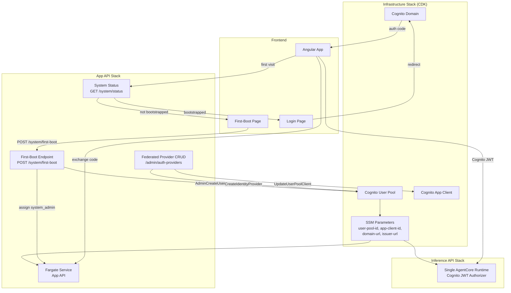
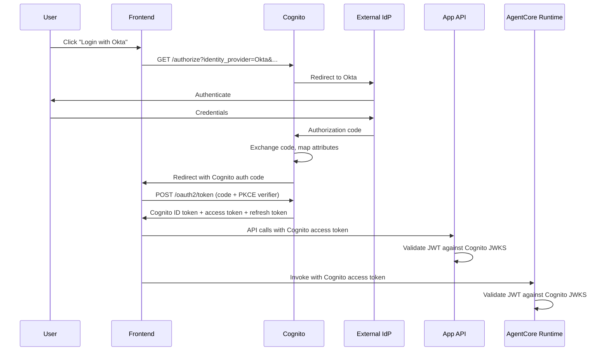
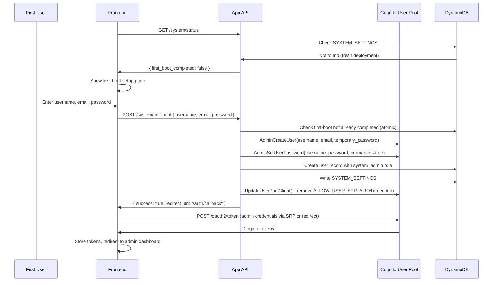

# Design Document: Cognito First-Boot Authentication

## Overview

This design replaces the current multi-step authentication bootstrap (GitHub secrets → seed workflow → multi-runtime provisioning) with a WordPress-style first-boot experience powered by Amazon Cognito. The core insight: because Cognito issues its own JWTs regardless of which upstream provider authenticated the user, the entire system can use a **single AgentCore Runtime** with a **single Cognito JWT authorizer** — eliminating the multi-runtime architecture, the Runtime Provisioner Lambda, the Runtime Updater Lambda, and the auth provider bootstrap seed workflow.

### What Changes

| Component | Before | After |
|---|---|---|
| Identity Broker | Per-provider OIDC (direct) | Amazon Cognito User Pool |
| First User Setup | GitHub secrets + seed workflow | First-boot signup page |
| AgentCore Runtimes | One per auth provider (Lambda-managed) | Single runtime (CDK-managed) |
| JWT Validation | `GenericOIDCJWTValidator` (multi-issuer) | `CognitoJWTValidator` (single issuer) |
| Frontend Auth | Custom OIDC via App API routes | Cognito OAuth 2.0 endpoints |
| Federated IdPs | Stored in DynamoDB only | Registered in Cognito + DynamoDB |
| Runtime Provisioner Lambda | Required | Removed |
| Runtime Updater Lambda | Required | Removed |
| Auth seed workflow | Required | Removed (for auth; quota/model seeding retained) |

### Key Design Decisions

1. **Cognito as identity broker, not identity store**: Cognito federates to external IdPs (Entra ID, Okta, Google) and issues its own JWTs. The application never validates upstream provider tokens directly.
2. **CDK-managed User Pool**: The Cognito User Pool, App Client, and Domain are created in the Infrastructure Stack via CDK — no manual setup required.
3. **First-boot via backend API**: The frontend detects a fresh deployment via `GET /system/status`, shows a setup page, and the backend creates the admin user via Cognito Admin API + assigns the `system_admin` role.
4. **Admin CRUD maps to Cognito APIs**: When an admin adds/updates/deletes a federated provider in the UI, the App API calls Cognito `CreateIdentityProvider`/`UpdateIdentityProvider`/`DeleteIdentityProvider` and updates the App Client's supported providers list.
5. **Single runtime with Cognito discovery URL**: The InferenceApiStack configures one AgentCore Runtime with `discoveryUrl` pointing to `https://cognito-idp.{region}.amazonaws.com/{userPoolId}/.well-known/openid-configuration`.

## Architecture

### High-Level Flow



### Authentication Flow (Post First-Boot)



### First-Boot Flow



## Components and Interfaces

### 1. Cognito User Pool (Infrastructure Stack)

The Infrastructure Stack creates the Cognito User Pool with CDK's L2 construct `cognito.UserPool`.

```typescript
// infrastructure/lib/infrastructure-stack.ts (new section)

const userPool = new cognito.UserPool(this, 'CognitoUserPool', {
  userPoolName: getResourceName(config, 'user-pool'),
  selfSignUpEnabled: true, // Enabled initially for first-boot; disabled after
  signInAliases: { username: true, email: true },
  autoVerify: { email: true },
  standardAttributes: {
    email: { required: true, mutable: true },
    givenName: { mutable: true },
    familyName: { mutable: true },
  },
  customAttributes: {
    'provider_sub': new cognito.StringAttribute({ mutable: true }),
  },
  passwordPolicy: {
    minLength: 8,
    requireUppercase: true,
    requireLowercase: true,
    requireDigits: true,
    requireSymbols: true,
  },
  accountRecovery: cognito.AccountRecovery.EMAIL_ONLY,
  removalPolicy: getRemovalPolicy(config),
});
```

**App Client** configuration:

```typescript
const callbackUrls = config.domainName
  ? [`https://${config.domainName}/auth/callback`]
  : ['http://localhost:4200/auth/callback'];

const logoutUrls = config.domainName
  ? [`https://${config.domainName}`]
  : ['http://localhost:4200'];

const appClient = userPool.addClient('CognitoAppClient', {
  userPoolClientName: getResourceName(config, 'app-client'),
  generateSecret: false, // SPA — no client secret
  authFlows: {
    userSrp: true,       // For username/password login
    custom: true,         // For custom auth challenges
  },
  oAuth: {
    flows: { authorizationCodeGrant: true },
    scopes: [
      cognito.OAuthScope.OPENID,
      cognito.OAuthScope.PROFILE,
      cognito.OAuthScope.EMAIL,
    ],
    callbackUrls,
    logoutUrls,
  },
  preventUserExistenceErrors: true,
  supportedIdentityProviders: [
    cognito.UserPoolClientIdentityProvider.COGNITO,
  ],
});
```

**Cognito Domain**:

```typescript
// Prefix-based domain using project prefix
const cognitoDomain = userPool.addDomain('CognitoDomain', {
  cognitoDomain: { domainPrefix: config.projectPrefix },
});
```

**SSM Exports**:

| Parameter Path | Value |
|---|---|
| `/${projectPrefix}/auth/cognito/user-pool-id` | User Pool ID |
| `/${projectPrefix}/auth/cognito/user-pool-arn` | User Pool ARN |
| `/${projectPrefix}/auth/cognito/app-client-id` | App Client ID |
| `/${projectPrefix}/auth/cognito/domain-url` | `https://{prefix}.auth.{region}.amazoncognito.com` |
| `/${projectPrefix}/auth/cognito/issuer-url` | `https://cognito-idp.{region}.amazonaws.com/{userPoolId}` |

### 2. First-Boot API Endpoints (App API)

New routes in `backend/src/apis/app_api/system/routes.py`:

```python
# GET /system/status — public, no auth required
@router.get("/status")
async def get_system_status() -> SystemStatusResponse:
    """Check if first-boot has been completed."""
    settings = await system_settings_repo.get_first_boot_status()
    return SystemStatusResponse(
        first_boot_completed=settings is not None and settings.completed,
    )

# POST /system/first-boot — public, no auth required, one-time only
@router.post("/first-boot")
async def first_boot(request: FirstBootRequest) -> FirstBootResponse:
    """Create the initial admin user. Rejects if already completed."""
    # 1. Atomic check: if first-boot already done, return 409
    # 2. Create user in Cognito via AdminCreateUser + AdminSetUserPassword
    # 3. Create user record in Users table with system_admin role
    # 4. Mark first-boot completed in DynamoDB (conditional write)
    # 5. Optionally disable self-signup on the User Pool
    ...
```

**Request/Response Models**:

```python
class FirstBootRequest(BaseModel):
    username: str = Field(..., min_length=3, max_length=128)
    email: str = Field(..., pattern=r'^[^@]+@[^@]+\.[^@]+$')
    password: str = Field(..., min_length=8)

class FirstBootResponse(BaseModel):
    success: bool
    user_id: str
    message: str

class SystemStatusResponse(BaseModel):
    first_boot_completed: bool
```

**Race Condition Protection**: The first-boot completion write uses a DynamoDB conditional expression `attribute_not_exists(PK)` to ensure only one concurrent request succeeds. If the condition fails, the endpoint returns 409.

### 3. Federated Identity Provider Management (App API)

The existing `/admin/auth-providers` CRUD endpoints are extended to call Cognito APIs alongside DynamoDB writes.

**Create Provider Flow**:

```python
async def create_provider(data: AuthProviderCreate) -> AuthProvider:
    # 1. OIDC discovery (existing logic)
    # 2. Register in Cognito
    cognito_client.create_identity_provider(
        UserPoolId=user_pool_id,
        ProviderName=data.provider_id,  # Must be unique within pool
        ProviderType='OIDC',
        ProviderDetails={
            'client_id': data.client_id,
            'client_secret': data.client_secret,
            'authorize_scopes': data.scopes,
            'oidc_issuer': data.issuer_url,
            # Cognito auto-discovers endpoints from issuer
            'attributes_request_method': 'GET',
        },
        AttributeMapping={
            'email': 'email',
            'name': 'name',
            'given_name': 'given_name',
            'family_name': 'family_name',
            'picture': 'picture',
            'custom:provider_sub': 'sub',
        },
    )
    # 3. Update App Client to include new provider
    cognito_client.update_user_pool_client(
        UserPoolId=user_pool_id,
        ClientId=app_client_id,
        SupportedIdentityProviders=[...existing, data.provider_id],
        # Preserve all other client settings
    )
    # 4. Save to DynamoDB (existing logic)
    # 5. Save client secret to Secrets Manager (existing logic)
    return provider
```

**Update Provider Flow**: Calls `UpdateIdentityProvider` with changed fields, then updates DynamoDB.

**Delete Provider Flow**: Calls `DeleteIdentityProvider`, removes from App Client's `SupportedIdentityProviders`, then deletes from DynamoDB and Secrets Manager.

**Cognito IAM Permissions** (added to App API task role):

```typescript
taskDefinition.taskRole.addToPrincipalPolicy(
  new iam.PolicyStatement({
    sid: 'CognitoIdentityProviderManagement',
    effect: iam.Effect.ALLOW,
    actions: [
      'cognito-idp:CreateIdentityProvider',
      'cognito-idp:UpdateIdentityProvider',
      'cognito-idp:DeleteIdentityProvider',
      'cognito-idp:DescribeIdentityProvider',
      'cognito-idp:ListIdentityProviders',
      'cognito-idp:UpdateUserPoolClient',
      'cognito-idp:DescribeUserPoolClient',
      'cognito-idp:AdminCreateUser',
      'cognito-idp:AdminSetUserPassword',
      'cognito-idp:AdminGetUser',
      'cognito-idp:UpdateUserPool',
    ],
    resources: [cognitoUserPoolArn],
  })
);
```

### 4. Single AgentCore Runtime with Cognito JWT Authorizer (Inference API Stack)

The InferenceApiStack creates a single CDK-managed runtime (replacing the Lambda-managed per-provider runtimes):

```typescript
// infrastructure/lib/inference-api-stack.ts

// Import Cognito config from SSM
const cognitoUserPoolId = ssm.StringParameter.valueForStringParameter(
  this, `/${config.projectPrefix}/auth/cognito/user-pool-id`
);
const cognitoAppClientId = ssm.StringParameter.valueForStringParameter(
  this, `/${config.projectPrefix}/auth/cognito/app-client-id`
);

// Construct Cognito OIDC discovery URL
const cognitoDiscoveryUrl = `https://cognito-idp.${config.awsRegion}.amazonaws.com/${cognitoUserPoolId}/.well-known/openid-configuration`;

const runtime = new bedrock.CfnRuntime(this, 'AgentCoreRuntime', {
  agentRuntimeName: getResourceName(config, 'agentcore_runtime').replace(/-/g, '_'),
  agentRuntimeArtifact: {
    containerConfiguration: { containerUri: containerImageUri },
  },
  authorizerConfiguration: {
    customJwtAuthorizer: {
      discoveryUrl: cognitoDiscoveryUrl,
      allowedClients: [cognitoAppClientId],
    },
  },
  roleArn: runtimeExecutionRole.roleArn,
  networkConfiguration: { networkMode: 'PUBLIC' },
  environmentVariables: { /* ... */ },
});
```

This single runtime accepts JWTs from all users because Cognito is the sole issuer — whether the user logged in with username/password or via a federated IdP (Entra ID, Okta, Google), the JWT is always issued by Cognito.

### 5. Backend JWT Validation Migration

Replace `GenericOIDCJWTValidator` with `CognitoJWTValidator`:

```python
# backend/src/apis/shared/auth/cognito_jwt_validator.py

class CognitoJWTValidator:
    """Validates JWT tokens against a single Cognito User Pool."""

    def __init__(self, user_pool_id: str, app_client_id: str, region: str):
        self._issuer = f"https://cognito-idp.{region}.amazonaws.com/{user_pool_id}"
        self._app_client_id = app_client_id
        jwks_url = f"{self._issuer}/.well-known/jwks.json"
        self._jwks_client = PyJWKClient(jwks_url, cache_keys=True)

    def validate_token(self, token: str) -> User:
        signing_key = self._jwks_client.get_signing_key_from_jwt(token)
        # Note: Cognito access tokens use `client_id` (not `aud`) for the app client.
        # PyJWT's `audience` param checks the `aud` claim, which is only present in
        # Cognito access tokens when resource binding is configured. Instead, we
        # verify `client_id` manually after decoding.
        payload = jwt.decode(
            token,
            signing_key.key,
            algorithms=["RS256"],
            issuer=self._issuer,
            options={"verify_exp": True, "verify_aud": False},
        )
        # Validate client_id for access tokens, aud for ID tokens
        token_client_id = payload.get("client_id") or payload.get("aud")
        if token_client_id != self._app_client_id:
            raise jwt.InvalidTokenError(
                f"Token client_id/aud '{token_client_id}' does not match expected '{self._app_client_id}'"
            )
        return User(
            user_id=payload["sub"],
            email=payload.get("email", ""),
            name=payload.get("name", payload.get("cognito:username", "")),
            roles=payload.get("custom:roles", "").split(",") if payload.get("custom:roles") else [],
            picture=payload.get("picture"),
        )
```

**Claim Mapping** (Cognito token claims):

| Cognito Claim | Maps To | Source |
|---|---|---|
| `sub` | `user_id` | Cognito-generated UUID |
| `email` | `email` | From Cognito or federated IdP |
| `name` | `name` | From Cognito or federated IdP |
| `cognito:username` | `username` | Cognito username |
| `cognito:groups` | `roles` | Cognito User Pool Groups |
| `custom:provider_sub` | (stored) | Original IdP `sub` claim |
| `picture` | `picture` | From federated IdP |

**Updated `get_current_user` dependency**:

```python
async def get_current_user(credentials = Depends(security)) -> User:
    if credentials is None:
        raise HTTPException(status_code=401, detail="Authentication required.")
    token = credentials.credentials
    validator = _get_cognito_validator()
    user = validator.validate_token(token)
    user.raw_token = token
    # Fire-and-forget sync to Users table
    sync_service = _get_user_sync_service()
    if sync_service and sync_service.enabled:
        asyncio.create_task(_sync_user_background(sync_service, user))
    return user
```

### 6. Frontend Authentication Flow Migration

The Angular `AuthService` is updated to use Cognito OAuth 2.0 endpoints directly:

```typescript
// Key changes to auth.service.ts

// Cognito endpoints derived from environment config
private cognitoDomain = environment.cognitoDomainUrl;
private cognitoClientId = environment.cognitoAppClientId;
private redirectUri = `${window.location.origin}/auth/callback`;

async login(providerId?: string): Promise<void> {
  const state = this.generateRandomState();
  const codeVerifier = this.generateCodeVerifier();
  const codeChallenge = await this.generateCodeChallenge(codeVerifier);

  sessionStorage.setItem('auth_state', state);
  sessionStorage.setItem('auth_code_verifier', codeVerifier);

  const params = new URLSearchParams({
    response_type: 'code',
    client_id: this.cognitoClientId,
    redirect_uri: this.redirectUri,
    scope: 'openid profile email',
    state,
    code_challenge: codeChallenge,
    code_challenge_method: 'S256',
  });

  // If a specific federated provider is selected, add identity_provider param
  if (providerId) {
    params.set('identity_provider', providerId);
  }

  window.location.href = `${this.cognitoDomain}/oauth2/authorize?${params}`;
}

async handleCallback(code: string, state: string): Promise<void> {
  // Verify state matches
  const storedState = sessionStorage.getItem('auth_state');
  if (state !== storedState) throw new Error('State mismatch');

  const codeVerifier = sessionStorage.getItem('auth_code_verifier');

  // Exchange code for tokens directly with Cognito
  const response = await fetch(`${this.cognitoDomain}/oauth2/token`, {
    method: 'POST',
    headers: { 'Content-Type': 'application/x-www-form-urlencoded' },
    body: new URLSearchParams({
      grant_type: 'authorization_code',
      client_id: this.cognitoClientId,
      code,
      redirect_uri: this.redirectUri,
      code_verifier: codeVerifier!,
    }),
  });

  const tokens = await response.json();
  this.storeTokens(tokens);
}
```

**Login Page**: Displays a username/password form (for Cognito native users) plus buttons for each configured federated provider (fetched from `GET /auth/providers`). Clicking a federated provider button calls `login(providerId)` which redirects to Cognito with `identity_provider={providerId}`.

### 7. Removal Plan

#### Remove from App API Stack (`app-api-stack.ts`):
- Runtime Provisioner Lambda function and DynamoDB Stream trigger
- Runtime Updater Lambda function and EventBridge trigger
- SNS topic and CloudWatch alarms for runtime provisioning
- `GET /auth/runtime-endpoint` route

#### Remove from Inference API Stack (`inference-api-stack.ts`):
- Nothing removed — the stack already creates shared resources. The single runtime is now CDK-managed here instead of Lambda-managed.

#### Remove from Config (`config.ts`):
- `entraClientId`, `entraTenantId` from `AppConfig`
- `entraRedirectUri` from `AppApiConfig`
- All Entra ID loading in `loadConfig()`

#### Remove from App API ECS environment:
- `ENTRA_CLIENT_ID`, `ENTRA_TENANT_ID`, `ENTRA_REDIRECT_URI` env vars
- `ENTRA_CLIENT_SECRET` secret

#### Remove from GitHub workflows:
- `CDK_ENTRA_CLIENT_ID`, `CDK_ENTRA_TENANT_ID`, `CDK_APP_API_ENTRA_REDIRECT_URI` variables
- `CDK_ENTRA_CLIENT_SECRET` secret

#### Remove from `scripts/common/load-env.sh`:
- Entra ID environment variable exports and context parameter generation

#### Remove from stack deployment scripts:
- Entra ID context parameters from all `synth.sh` and `deploy.sh` files

#### Remove from bootstrap seed workflow:
- Auth provider seeding job (`SEED_AUTH_*` variables/secrets)
- Auth provider seeding logic in `seed.sh` and `seed_bootstrap_data.py`
- Retain: quota tier, quota assignment, and model seeding

#### Remove from backend:
- `GenericOIDCJWTValidator` class
- Multi-provider issuer resolution logic in `dependencies.py`
- `backend/lambda-functions/runtime-provisioner/` directory
- `backend/lambda-functions/runtime-updater/` directory

#### Remove from frontend:
- Per-provider runtime endpoint resolution
- `getRuntimeEndpoint()` API call


## Data Models

### SSM Parameter Paths (New — Cognito)

| Parameter Path | Created By | Consumed By | Value |
|---|---|---|---|
| `/${projectPrefix}/auth/cognito/user-pool-id` | InfrastructureStack | AppApiStack, InferenceApiStack | Cognito User Pool ID |
| `/${projectPrefix}/auth/cognito/user-pool-arn` | InfrastructureStack | AppApiStack | Cognito User Pool ARN |
| `/${projectPrefix}/auth/cognito/app-client-id` | InfrastructureStack | AppApiStack, InferenceApiStack, FrontendStack | Cognito App Client ID |
| `/${projectPrefix}/auth/cognito/domain-url` | InfrastructureStack | AppApiStack, FrontendStack | `https://{prefix}.auth.{region}.amazoncognito.com` |
| `/${projectPrefix}/auth/cognito/issuer-url` | InfrastructureStack | AppApiStack | `https://cognito-idp.{region}.amazonaws.com/{userPoolId}` |

### DynamoDB: System Settings Item

Stored in an existing table (e.g., the Users table or a dedicated settings table). Uses a single-item pattern:

```
PK: "SYSTEM_SETTINGS#first-boot"
SK: "SYSTEM_SETTINGS#first-boot"
Attributes:
  completed: boolean (true)
  completedAt: string (ISO 8601)
  completedBy: string (admin user ID)
  adminUsername: string
  adminEmail: string
```

**Idempotency**: The `POST /system/first-boot` endpoint uses `attribute_not_exists(PK)` as a condition expression on the `put_item` call. If two requests race, exactly one succeeds and the other gets a `ConditionalCheckFailedException` → 409 Conflict.

### DynamoDB: Auth Providers Table (Modified)

The existing `AUTH_PROVIDER#{id}` items gain a new optional field:

```
cognitoProviderName: string  # The name registered in Cognito (matches provider_id)
```

The `agentcore_runtime_*` fields are retained but deprecated — the App API stops writing to them for new providers. Existing values are left in place for reference during migration.

### Cognito Attribute Mappings

When registering a federated OIDC provider in Cognito, the following attribute mappings are configured:

| Cognito Attribute | Provider Claim | Notes |
|---|---|---|
| `email` | `email` | Required; sign-in rejected if missing |
| `name` | `name` | Display name |
| `given_name` | `given_name` | First name |
| `family_name` | `family_name` | Last name |
| `picture` | `picture` | Profile picture URL |
| `custom:provider_sub` | `sub` | Original provider user ID |

Admins can customize these mappings per provider via the admin UI. The App API passes the custom mappings to `CreateIdentityProvider`'s `AttributeMapping` parameter.

### CDK Configuration Changes (`config.ts`)

New `CognitoConfig` interface added to `AppConfig`:

```typescript
export interface CognitoConfig {
  domainPrefix?: string;       // Custom Cognito domain prefix (defaults to projectPrefix)
  callbackUrls?: string[];     // Additional callback URLs beyond auto-derived
  logoutUrls?: string[];       // Additional logout URLs beyond auto-derived
  passwordMinLength?: number;  // Override default 8
}

export interface AppConfig {
  // ... existing fields
  cognito: CognitoConfig;
  // REMOVED: entraClientId, entraTenantId
}

export interface AppApiConfig {
  // ... existing fields
  // REMOVED: entraRedirectUri
}
```

Loading in `loadConfig()`:

```typescript
cognito: {
  domainPrefix: process.env.CDK_COGNITO_DOMAIN_PREFIX
    || scope.node.tryGetContext('cognito')?.domainPrefix
    || projectPrefix,
  callbackUrls: process.env.CDK_COGNITO_CALLBACK_URLS?.split(',')
    || scope.node.tryGetContext('cognito')?.callbackUrls,
  logoutUrls: process.env.CDK_COGNITO_LOGOUT_URLS?.split(',')
    || scope.node.tryGetContext('cognito')?.logoutUrls,
  passwordMinLength: parseIntEnv(process.env.CDK_COGNITO_PASSWORD_MIN_LENGTH)
    || scope.node.tryGetContext('cognito')?.passwordMinLength
    || 8,
},
```

### Frontend Environment Configuration

New environment variables for the Angular app:

```typescript
// frontend/ai.client/src/environments/environment.ts
export const environment = {
  production: false,
  appApiUrl: 'http://localhost:8000',
  // Cognito configuration (injected at build time or fetched from /system/config)
  cognitoDomainUrl: '', // e.g., https://myprefix.auth.us-east-1.amazoncognito.com
  cognitoAppClientId: '', // e.g., 1abc2def3ghi4jkl5mno
  cognitoRegion: 'us-east-1',
  // Single runtime endpoint (replaces per-provider resolution)
  inferenceApiUrl: 'http://localhost:8001',
};
```

These values can be injected at deploy time by the frontend build script reading from SSM, or served by a `GET /system/config` endpoint from the App API.


## Correctness Properties

*A property is a characteristic or behavior that should hold true across all valid executions of a system — essentially, a formal statement about what the system should do. Properties serve as the bridge between human-readable specifications and machine-verifiable correctness guarantees.*

### Property 1: Cognito SSM export path correctness

*For any* valid project prefix, the Infrastructure Stack SHALL export Cognito resource identifiers to SSM parameters whose paths all begin with `/${projectPrefix}/auth/cognito/` and include at minimum: `user-pool-id`, `user-pool-arn`, `app-client-id`, `domain-url`, and `issuer-url`.

**Validates: Requirements 1.4, 13.3**

### Property 2: Callback URL derivation from domain configuration

*For any* CDK configuration, if `domainName` is provided, the Cognito App Client callback URLs SHALL include `https://{domainName}/auth/callback`; if `domainName` is not provided, the callback URLs SHALL include `http://localhost:4200/auth/callback` as the default development fallback.

**Validates: Requirements 1.7, 1.8**

### Property 3: First-boot creates admin with correct role

*For any* valid first-boot request (username, email, password), after the `POST /system/first-boot` endpoint succeeds, the Cognito User Pool SHALL contain a user with the given username and email, the Users DynamoDB table SHALL contain a record with the `system_admin` role, and the `SYSTEM_SETTINGS#first-boot` item SHALL exist in DynamoDB with `completed=true`.

**Validates: Requirements 2.3, 2.4, 2.5**

### Property 4: First-boot rejection after completion

*For any* number of `POST /system/first-boot` requests after the first successful one, the App API SHALL return HTTP 409 Conflict and the system state SHALL remain unchanged from the first successful boot.

**Validates: Requirements 2.7**

### Property 5: First-boot disables self-signup

*For any* successful first-boot completion, the App API SHALL call Cognito's `UpdateUserPool` API to set `AdminCreateUserConfig.AllowAdminCreateUserOnly` to `true`, preventing further self-signup.

**Validates: Requirements 2.6**

### Property 6: Cognito JWT validation rejects invalid tokens

*For any* JWT token, the `CognitoJWTValidator` SHALL accept the token if and only if: (a) the signature is valid against the Cognito JWKS, (b) the issuer matches `https://cognito-idp.{region}.amazonaws.com/{userPoolId}`, (c) the `client_id` claim (for access tokens) or `aud` claim (for ID tokens) matches the Cognito App Client ID, and (d) the token is not expired.

**Validates: Requirements 3.4, 10.1, 10.2, 10.3**

### Property 7: Cognito claim extraction correctness

*For any* valid Cognito JWT payload containing `sub`, `email`, `name`, and `cognito:groups` claims, the `CognitoJWTValidator.validate_token()` SHALL return a `User` object where `user_id` equals the `sub` claim, `email` equals the `email` claim, `name` equals the `name` claim (falling back to `cognito:username`), and `roles` equals the `cognito:groups` list.

**Validates: Requirements 3.6, 10.4**

### Property 8: Provider creation registers in Cognito with correct attribute mappings

*For any* valid auth provider configuration with custom attribute mappings, the `create_provider` function SHALL call Cognito `CreateIdentityProvider` with `ProviderDetails` containing the issuer URL and client ID, and `AttributeMapping` containing at minimum `email→email` and `custom:provider_sub→sub`, plus any admin-specified custom mappings.

**Validates: Requirements 4.1, 4.3, 9.1, 9.2, 9.4**

### Property 9: Provider creation stores configuration in DynamoDB and Secrets Manager

*For any* valid auth provider creation request, the provider configuration SHALL be stored in the Auth Providers DynamoDB table with PK `AUTH_PROVIDER#{providerId}`, and the client secret SHALL be stored in Secrets Manager under the provider ID key.

**Validates: Requirements 4.2**

### Property 10: Provider creation updates App Client supported providers

*For any* successful provider creation, the App API SHALL call `UpdateUserPoolClient` with `SupportedIdentityProviders` containing the new provider name in addition to all previously supported providers (including `COGNITO`).

**Validates: Requirements 4.4**

### Property 11: Provider update syncs to Cognito

*For any* valid provider update that changes OIDC configuration (issuer URL, client ID, or attribute mappings), the App API SHALL call `UpdateIdentityProvider` with the updated `ProviderDetails` and/or `AttributeMapping`.

**Validates: Requirements 4.5**

### Property 12: Provider deletion removes from Cognito and App Client

*For any* provider deletion, the App API SHALL call `DeleteIdentityProvider` to remove the provider from the Cognito User Pool AND call `UpdateUserPoolClient` to remove the provider from `SupportedIdentityProviders`, AND delete the provider from DynamoDB and its secret from Secrets Manager.

**Validates: Requirements 4.6**

### Property 13: Cognito discovery URL construction

*For any* valid AWS region string and Cognito User Pool ID, the discovery URL SHALL be constructed as `https://cognito-idp.{region}.amazonaws.com/{userPoolId}/.well-known/openid-configuration`.

**Validates: Requirements 5.6**

### Property 14: New providers do not write deprecated runtime fields

*For any* new auth provider created after the Cognito migration, the DynamoDB item SHALL NOT contain non-null values for `agentcoreRuntimeArn`, `agentcoreRuntimeId`, or `agentcoreRuntimeEndpointUrl`.

**Validates: Requirements 6.4**

### Property 15: System status round-trip

*For any* DynamoDB state, the `GET /system/status` endpoint SHALL return `first_boot_completed=true` if and only if the `SYSTEM_SETTINGS#first-boot` item exists in DynamoDB with `completed=true`; otherwise it SHALL return `first_boot_completed=false`.

**Validates: Requirements 12.1, 12.2**

### Property 16: Concurrent first-boot safety

*For any* number of concurrent `POST /system/first-boot` requests on a fresh deployment, exactly one SHALL succeed (HTTP 200) and all others SHALL fail (HTTP 409), and the DynamoDB table SHALL contain exactly one `SYSTEM_SETTINGS#first-boot` item and exactly one admin user.

**Validates: Requirements 12.4**

### Property 17: CDK config loading with environment variable overrides

*For any* CDK configuration where both an environment variable (`CDK_COGNITO_DOMAIN_PREFIX`) and a CDK context value (`cognito.domainPrefix`) are set, the environment variable SHALL take precedence over the context value.

**Validates: Requirements 13.2**

## Error Handling

| Scenario | Behavior | HTTP Status |
|---|---|---|
| First-boot attempted after completion | Return error, no state change | 409 Conflict |
| First-boot with invalid password (doesn't meet policy) | Return Cognito error details | 400 Bad Request |
| First-boot with duplicate username in Cognito | Return error, no state change | 409 Conflict |
| First-boot Cognito API failure (AdminCreateUser) | Return error, do NOT mark first-boot complete | 500 Internal Server Error |
| First-boot DynamoDB conditional write failure (race) | Return conflict error | 409 Conflict |
| Cognito CreateIdentityProvider failure (duplicate name) | Return Cognito error details, no DynamoDB write | 400 Bad Request |
| Cognito CreateIdentityProvider failure (invalid issuer) | Return Cognito error details, no DynamoDB write | 400 Bad Request |
| Cognito UpdateIdentityProvider failure | Return error, DynamoDB not updated | 500 Internal Server Error |
| Cognito DeleteIdentityProvider failure (not found) | Log warning, continue with DynamoDB deletion | 200 (idempotent) |
| Cognito UpdateUserPoolClient failure | Return error, roll back CreateIdentityProvider if during creation | 500 Internal Server Error |
| JWT validation: invalid signature | Reject request | 401 Unauthorized |
| JWT validation: expired token | Reject with "Token expired" message | 401 Unauthorized |
| JWT validation: wrong issuer | Reject request | 401 Unauthorized |
| JWT validation: wrong audience | Reject request | 401 Unauthorized |
| JWT validation: Cognito JWKS endpoint unreachable | Reject with "Authentication service unavailable" | 503 Service Unavailable |
| System status endpoint: DynamoDB read failure | Return `first_boot_completed: false` (safe default) | 200 OK |
| Federated provider missing required email attribute | Cognito rejects sign-in; frontend shows descriptive error | N/A (Cognito-side) |
| OIDC discovery failure during provider creation | Return error with discovery failure details | 400 Bad Request |

### Rollback Strategy for Provider Creation

Provider creation involves multiple steps (Cognito + DynamoDB + Secrets Manager). If any step fails after a previous step succeeded:

1. **Cognito CreateIdentityProvider succeeds, UpdateUserPoolClient fails**: Delete the identity provider from Cognito (rollback), return error.
2. **Cognito succeeds, DynamoDB write fails**: Delete identity provider from Cognito, return error.
3. **Cognito + DynamoDB succeed, Secrets Manager fails**: Delete from DynamoDB, delete identity provider from Cognito, return error.

Each rollback step is wrapped in try/except to avoid masking the original error.

## Testing Strategy

### Dual Testing Approach

This feature requires both unit tests and property-based tests:

- **Unit tests** (pytest): Specific examples, edge cases, error conditions, CDK template assertions
- **Property-based tests** (pytest + Hypothesis): Universal properties across randomized inputs

Both are complementary — unit tests catch concrete bugs with known inputs, property tests verify general correctness across the input space.

### Property-Based Testing Configuration

- **Library**: `hypothesis` (Python) — already used in the project (see `backend/.hypothesis/`)
- **Minimum iterations**: 100 per property test (`@settings(max_examples=100)`)
- **Tag format**: `Feature: cognito-first-boot-auth, Property {N}: {title}`
- **Each correctness property is implemented by a single property-based test**
- **Mock infrastructure**: `moto` for DynamoDB, Secrets Manager, and Cognito; `unittest.mock` for Cognito API calls where moto coverage is insufficient

### Unit Tests

Focus on specific examples and edge cases:

- CDK template assertions: Cognito User Pool has correct password policy, App Client has correct OAuth config, SSM parameters exist with correct paths
- First-boot with valid credentials creates admin user (happy path)
- First-boot with weak password returns 400
- First-boot after completion returns 409
- Provider creation with OIDC discovery populates endpoints
- Provider deletion cleans up Cognito + DynamoDB + Secrets Manager
- `CognitoJWTValidator` rejects tokens with wrong issuer
- `CognitoJWTValidator` rejects expired tokens
- System status returns false on fresh deployment
- System status returns true after first-boot
- Config loading: `CDK_COGNITO_DOMAIN_PREFIX` env var overrides context

### Property-Based Tests

Each correctness property maps to one Hypothesis test:

- **Feature: cognito-first-boot-auth, Property 1: Cognito SSM export path correctness** — Generate random valid project prefixes, verify SSM parameter paths follow convention
- **Feature: cognito-first-boot-auth, Property 2: Callback URL derivation** — Generate random domain names (or None), verify callback URLs are derived correctly
- **Feature: cognito-first-boot-auth, Property 3: First-boot creates admin** — Generate random valid usernames/emails/passwords, run first-boot against mocked Cognito+DynamoDB, verify admin user and settings
- **Feature: cognito-first-boot-auth, Property 4: First-boot rejection** — Generate random valid first-boot requests, run first-boot twice, verify second returns 409
- **Feature: cognito-first-boot-auth, Property 5: First-boot disables self-signup** — Generate random first-boot requests, verify UpdateUserPool is called with AllowAdminCreateUserOnly=true
- **Feature: cognito-first-boot-auth, Property 6: JWT validation** — Generate random JWT payloads with valid/invalid issuers/audiences, verify accept/reject behavior
- **Feature: cognito-first-boot-auth, Property 7: Claim extraction** — Generate random Cognito-style JWT payloads, verify User object fields match claims
- **Feature: cognito-first-boot-auth, Property 8: Provider creation Cognito registration** — Generate random provider configs with custom attribute mappings, verify CreateIdentityProvider call parameters
- **Feature: cognito-first-boot-auth, Property 9: Provider creation DynamoDB + Secrets Manager** — Generate random provider configs, verify DynamoDB item and Secrets Manager write
- **Feature: cognito-first-boot-auth, Property 10: Provider creation App Client update** — Generate random sequences of provider creations, verify SupportedIdentityProviders grows correctly
- **Feature: cognito-first-boot-auth, Property 11: Provider update Cognito sync** — Generate random provider updates, verify UpdateIdentityProvider is called with correct params
- **Feature: cognito-first-boot-auth, Property 12: Provider deletion cleanup** — Generate random provider creation+deletion sequences, verify all resources are cleaned up
- **Feature: cognito-first-boot-auth, Property 13: Discovery URL construction** — Generate random region strings and User Pool IDs, verify URL format
- **Feature: cognito-first-boot-auth, Property 14: No deprecated runtime fields** — Generate random new provider configs, verify DynamoDB items lack runtime fields
- **Feature: cognito-first-boot-auth, Property 15: System status round-trip** — Generate random DynamoDB states (with/without first-boot item), verify endpoint response matches
- **Feature: cognito-first-boot-auth, Property 16: Concurrent first-boot safety** — Generate random concurrent first-boot requests, verify exactly one succeeds
- **Feature: cognito-first-boot-auth, Property 17: Config env var override** — Generate random env var and context values, verify env var wins

### Test Infrastructure

- `moto` for mocking AWS services (DynamoDB, Secrets Manager, Cognito)
- `httpx` or `responses` for mocking OIDC discovery HTTP calls
- `PyJWT` for generating test JWT tokens with known signing keys
- `hypothesis` strategies for generating valid usernames, emails, passwords, provider configs, JWT payloads
- Tests located at:
  - `backend/tests/apis/shared/auth/test_cognito_jwt_validator.py`
  - `backend/tests/apis/app_api/system/test_first_boot.py`
  - `backend/tests/apis/app_api/admin/test_auth_providers_cognito.py`
  - `infrastructure/test/cognito-infrastructure.test.ts` (CDK assertions)
