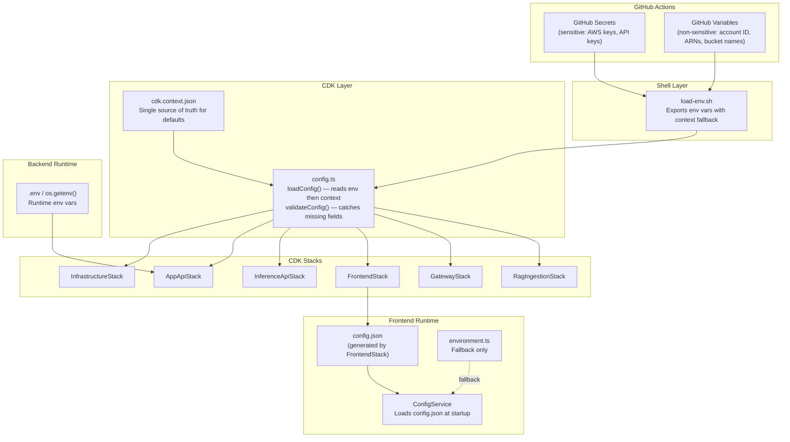

# Design Document: Config Cleanup Audit

## Overview

This feature performs a comprehensive audit and cleanup of configuration across the AgentCore Public Stack. Configuration is spread across five layers: CDK TypeScript interfaces (`config.ts`), CDK context defaults (`cdk.context.json`), shell environment loader (`load-env.sh`), backend environment templates (`.env.example`), frontend environment files, and GitHub Actions workflows. Over time, dead config has accumulated — RDS fields hardcoded to disabled, CORS origins duplicated four times, GPU flags no stack consumes, and auth toggles for an app that cannot function without auth.

The cleanup is organized into three categories:

1. **Dead code removal** (Reqs 1, 2, 4, 5, 10, 11, 14, 15, 18): Remove fields, interfaces, functions, and plumbing that nothing consumes.
2. **Consolidation and normalization** (Reqs 3, 6, 7, 8, 13, 16, 17): Deduplicate CORS, enforce the config default hierarchy, synchronize files, migrate GitHub Secrets to Variables.
3. **Validation and documentation** (Reqs 9, 12): Add startup validation rules and produce a CONFIG_INVENTORY.md.

All changes are purely configuration-level — no new features, no new runtime behavior, no new AWS resources. The application's functional behavior is unchanged; the configuration surface shrinks.

## Architecture

The configuration system follows a layered architecture with a strict precedence hierarchy:

```
Environment Variables  >  CDK Context (cdk.context.json)  >  (no hardcoded defaults)
```



After cleanup, the architecture remains identical — only the set of fields flowing through each layer shrinks.

## Components and Interfaces

### CDK Config Layer (`infrastructure/lib/config.ts`)

#### Removed Interfaces/Fields

| Interface | Removed Fields | Reason |
|-----------|---------------|--------|
| `AppApiConfig` | `enableRds`, `rdsInstanceClass`, `rdsEngine`, `rdsDatabaseName`, `databaseType` | Hardcoded to disabled/none, never consumed by any stack (Reqs 1, 5) |
| `InferenceApiConfig` | `enableGpu`, `uploadDir`, `outputDir`, `generatedImagesDir`, `apiUrl`, `frontendUrl`, `enableAuthentication`, `oauthCallbackUrl` | GPU never provisioned; dirs are container-internal; apiUrl/frontendUrl are dead; auth always on; OAuth URL derived at runtime (Reqs 2, 4, 14, 15, 18) |
| `FrontendConfig` | `enableRoute53` | Derived from `config.domainName` being set (Req 10) |

#### Added Fields

| Interface | New Field | Reason |
|-----------|----------|--------|
| `AppConfig` | `corsOrigins: string` | Top-level shared CORS origins, replacing four duplicated per-section values (Req 3) |

#### Modified `loadConfig()`

- All hardcoded fallback defaults (e.g., `parseBooleanEnv(..., true)`, `|| 365`, `|| 10240`) are removed. Each field reads env var first, then `scope.node.tryGetContext()`. Defaults live exclusively in `cdk.context.json` (Req 17).
- Exception: Empty-string fallbacks (`|| ''`) for `imageTag` and `ragIngestion.corsOrigins` are retained as "not set" sentinels (Req 17.5).

#### Modified `validateConfig()`

New validation rules (Req 9):
- When `gateway.enabled` is true, verify `gateway.apiType` is `'REST'` or `'HTTP'`.
- When `fileUpload.enabled` is true, verify CORS origins are available (top-level or section-level).
- When any stack is enabled, verify its required fields are populated. Throw a descriptive error identifying the missing field and which stack requires it.

### CDK Context (`cdk.context.json`)

After cleanup, the context file becomes the single source of truth for all defaults. Key changes:

- Remove: `enableRds`, `rdsInstanceClass`, `rdsEngine`, `rdsDatabaseName`, `databaseType`, `enableGpu`, `uploadDir`, `outputDir`, `generatedImagesDir`, `apiUrl`, `frontendUrl`, `enableAuthentication` (inferenceApi), `oauthCallbackUrl`, `enableRoute53`, `entraClientId`, `entraTenantId`
- Add top-level: `corsOrigins`, `production`, `retainDataOnDelete` (set to `false` per Req 16)
- Add to sections: all defaults previously hardcoded in `loadConfig()` (e.g., `fileUpload.maxFileSizeBytes: 4194304`, `ragIngestion.lambdaMemorySize: 10240`, etc.)
- Consolidate: single top-level `corsOrigins` replaces duplicated values in `fileUpload`, `assistants`, `ragIngestion`

### Shell Layer (`scripts/common/load-env.sh`)

- Remove exports and context params for all deleted fields (GPU, dirs, auth toggle, oauthCallbackUrl, enableRoute53, etc.)
- Remove hardcoded bash defaults (`:-true`, `:-http://localhost:4200`, `:-10`). Each variable falls back to `get_json_value` from the context file.
- Remove `CDK_ENABLE_AUTHENTICATION` export and validation.

### Frontend Config (`ConfigService`, `environment.ts`)

- Remove `inferenceApiUrl` from `RuntimeConfig` interface, computed signal, `encodeUrlPath` helper, and all fallback logic (Req 15).
- Remove `enableAuthentication` from `RuntimeConfig` interface, computed signal, and all conditional bypass paths in guards/interceptors/services (Req 14).
- Remove `inferenceApiUrl` and `enableAuthentication` from `environment.ts` and `environment.production.ts`.
- Remove dead `environment` import from `error.interceptor.ts` (Req 7).
- Update `preview-chat.service.ts` to resolve runtime endpoint dynamically via `authApiService.getRuntimeEndpoint()` instead of static `config.inferenceApiUrl()` (Req 15).

### Frontend Stack (`infrastructure/lib/frontend-stack.ts`)

- Remove `enableAuthentication` from generated `config.json` (always true, no longer configurable).
- Change Route53 condition from `config.frontend.enableRoute53 && config.domainName` to just `config.domainName` (Req 10).

### Backend Auth (`backend/src/apis/shared/auth/dependencies.py`)

- Remove `ENABLE_AUTHENTICATION` env var check, `_check_auth_bypass()`, `_create_anonymous_dev_user()`.
- Remove all `bypass_user = _check_auth_bypass()` calls from `get_current_user` and `get_current_user_trusted`.
- Authentication is always enforced.

### GitHub Actions Workflows

- Migrate `CDK_AWS_ACCOUNT`, `CDK_FRONTEND_CERTIFICATE_ARN`, `CDK_FRONTEND_BUCKET_NAME`, `SEED_AUTH_CLIENT_ID` from `secrets.*` to `vars.*` (Req 13).
- Remove env entries for all deleted config fields across all workflow files.
- Update `ACTIONS-REFERENCE.md` and `README-ACTIONS.md` accordingly.

### Documentation

- Create `docs/CONFIG_INVENTORY.md` listing every config variable, its source, and consuming module (Req 12).
- Update `backend/src/apis/shared/auth/README.md` to remove ENABLE_AUTHENTICATION docs (Req 14).

### Resource Tagging (`config.ts`, `cdk.context.json`)

Current state: `loadConfig()` hardcodes `Project: projectPrefix` and `ManagedBy: 'CDK'` in the `tags` object, then merges `...scope.node.tryGetContext('tags')` on top. The context file has `Environment: 'dev'`, `Project: 'AgentCore'`, `ManagedBy: 'CDK'`. This creates conflicts — `Project` is set twice with different values, and `Environment: 'dev'` is baked in regardless of actual deployment target.

After cleanup:
- `loadConfig()` loads tags entirely from context: `tags: scope.node.tryGetContext('tags') || {}`
- No hardcoded tag literals in `config.ts`
- The context file `tags` section becomes the single source of truth for default tags
- `Project` tag uses the `projectPrefix` value — since CDK context can't interpolate, `applyStandardTags()` will inject `Project: config.projectPrefix` alongside the context tags, ensuring it always matches the actual prefix
- `Environment` tag is removed from context defaults (or set to a meaningful placeholder) since it doesn't reflect actual deployment environment
- Review `@aws-cdk/core:checksumAssetForResourceTags` flag for unexpected tag injection

## Data Models

No new data models are introduced. This feature only modifies configuration interfaces (TypeScript types) and removes fields. The key interface changes are:

### Before → After: `AppConfig`

```typescript
// ADDED
corsOrigins: string;  // Top-level shared CORS origins

// UNCHANGED (all other fields)
```

### Before → After: `AppApiConfig`

```typescript
// REMOVED: enableRds, rdsInstanceClass, rdsEngine, rdsDatabaseName, databaseType
// REMAINING:
enabled: boolean;
cpu: number;
memory: number;
desiredCount: number;
maxCapacity: number;
imageTag: string;
```

### Before → After: `InferenceApiConfig`

```typescript
// REMOVED: enableGpu, uploadDir, outputDir, generatedImagesDir, apiUrl, frontendUrl,
//          enableAuthentication, oauthCallbackUrl
// REMAINING:
enabled: boolean;
cpu: number;
memory: number;
desiredCount: number;
maxCapacity: number;
imageTag: string;
logLevel: string;
corsOrigins: string;
tavilyApiKey: string;
novaActApiKey: string;
```

### Before → After: `FrontendConfig`

```typescript
// REMOVED: enableRoute53
// REMAINING:
certificateArn?: string;
enabled: boolean;
bucketName?: string;
cloudFrontPriceClass: string;
```

### Before → After: `RuntimeConfig` (Frontend)

```typescript
// REMOVED: inferenceApiUrl, enableAuthentication
// REMAINING:
appApiUrl: string;
environment: string;
```


## Correctness Properties

*A property is a characteristic or behavior that should hold true across all valid executions of a system — essentially, a formal statement about what the system should do. Properties serve as the bridge between human-readable specifications and machine-verifiable correctness guarantees.*

### Property 1: Removed config fields do not exist on loaded config

*For any* field in the removed-fields set (`enableRds`, `rdsInstanceClass`, `rdsEngine`, `rdsDatabaseName`, `databaseType`, `enableGpu`, `uploadDir`, `outputDir`, `generatedImagesDir`, `apiUrl`, `frontendUrl`, `enableAuthentication` on InferenceApiConfig, `oauthCallbackUrl`, `enableRoute53`), loading the CDK config shall produce an object where that field is absent from its parent interface.

**Validates: Requirements 1.1, 2.1, 4.1, 5.1, 10.1, 15.9, 18.1**

### Property 2: Removed context keys do not exist in cdk.context.json

*For any* key in the removed-context-keys set (`enableRds`, `rdsInstanceClass`, `rdsEngine`, `rdsDatabaseName`, `databaseType`, `enableGpu`, `uploadDir`, `outputDir`, `generatedImagesDir`, `apiUrl`, `frontendUrl`, `enableAuthentication` under inferenceApi, `oauthCallbackUrl`, `enableRoute53`, `entraClientId`, `entraTenantId`), parsing `cdk.context.json` shall not find that key in its expected section.

**Validates: Requirements 1.2, 2.2, 4.2, 5.2, 8.5, 10.2, 11.4, 18.4**

### Property 3: CORS origins fallback chain

*For any* config section that consumes CORS origins (`fileUpload`, `assistants`, `ragIngestion`), the effective CORS value shall equal the per-section override if one is set, otherwise the top-level `corsOrigins` value from `AppConfig`.

**Validates: Requirements 3.2, 3.3, 3.5**

### Property 4: .env.example ↔ Python source synchronization

*For any* environment variable name, it appears as an entry in `.env.example` if and only if at least one Python source file under `backend/src/` references it via `os.getenv` or `os.environ`.

**Validates: Requirements 6.1, 6.3, 6.4**

### Property 5: Context file ↔ config.ts synchronization

*For any* context key read by `loadConfig()` via `scope.node.tryGetContext()`, `cdk.context.json` shall contain a corresponding key at the matching path. Conversely, for any non-framework key in `cdk.context.json`, `loadConfig()` shall read it.

**Validates: Requirements 8.1, 8.2, 8.5**

### Property 6: validateConfig rejects missing required fields for enabled stacks

*For any* stack section where `enabled` is true, if a required configuration field for that stack is missing or empty, `validateConfig()` shall throw an error whose message contains both the field name and the stack name. Specifically: when `gateway.enabled` is true, `apiType` must be `'REST'` or `'HTTP'`; when `fileUpload.enabled` is true, CORS origins must be available.

**Validates: Requirements 9.1, 9.2, 9.3, 9.4**

### Property 7: GitHub workflow values use correct source type

*For any* configuration value referenced in GitHub Actions workflow files, it shall use `vars.*` if it is in the non-sensitive set (`CDK_AWS_ACCOUNT`, `CDK_FRONTEND_CERTIFICATE_ARN`, `CDK_FRONTEND_BUCKET_NAME`, `SEED_AUTH_CLIENT_ID`) and `secrets.*` if it is in the sensitive set (`AWS_ACCESS_KEY_ID`, `AWS_SECRET_ACCESS_KEY`, `AWS_ROLE_ARN`, `ENV_INFERENCE_API_TAVILY_API_KEY`, `ENV_INFERENCE_API_NOVA_ACT_API_KEY`, `SEED_AUTH_CLIENT_SECRET`).

**Validates: Requirements 13.1, 13.2**

### Property 8: No ENABLE_AUTHENTICATION references remain in executable code

*For any* source file (TypeScript or Python) in the codebase, the string `ENABLE_AUTHENTICATION` or `enableAuthentication` shall not appear in executable code (imports, variable declarations, function calls, conditionals). Occurrences in comments, documentation files, and git history are excluded.

**Validates: Requirements 14.8, 14.9, 14.10**

### Property 9: No hardcoded defaults in loadConfig except empty-string sentinels

*For any* configuration field in `loadConfig()`, the loading expression shall not contain a hardcoded literal fallback (e.g., `|| 365`, `parseBooleanEnv(..., true)`) except for empty-string sentinels (`|| ''`) on fields designated as "not set" indicators (`imageTag`, `ragIngestion.corsOrigins`).

**Validates: Requirements 17.1, 17.2, 17.5**

### Property 10: No hardcoded bash defaults in load-env.sh

*For any* CDK configuration variable exported in `load-env.sh`, the export statement shall not contain a bash default value (e.g., `:-true`, `:-10`). Each variable shall fall back to `get_json_value` from the context file or be left unset.

**Validates: Requirements 17.3, 17.4**

### Property 11: Route53 record creation derived from domainName

*For any* CDK synth of the FrontendStack, a Route53 A record shall be created if and only if `config.domainName` is set (non-empty). The `enableRoute53` flag shall not exist or be consulted.

**Validates: Requirements 10.3, 10.4**

## Error Handling

### CDK Synth Time

- `validateConfig()` throws descriptive errors for missing required fields, identifying the field name and the stack that requires it.
- TypeScript compiler catches references to removed interface fields at build time.
- `parseBooleanEnv()` throws on invalid boolean strings (not `true`/`false`/`1`/`0`).

### Frontend Runtime

- `ConfigService.loadConfig()` falls back to `environment.ts` values if `/config.json` fetch fails. After cleanup, the fallback config only contains `appApiUrl` and `environment`.
- `ConfigService.validateConfig()` rejects configs missing `appApiUrl` or `environment`.
- `preview-chat.service.ts` handles the case where `authApiService.getRuntimeEndpoint()` fails by surfacing an error to the user.

### Backend Runtime

- `get_current_user()` always enforces authentication. Missing or invalid tokens return 401. No auth providers configured returns 500.
- No silent auth bypass path exists after cleanup.

### Shell Scripts

- `load-env.sh` validates required variables (`CDK_PROJECT_PREFIX`, `CDK_AWS_ACCOUNT`, `CDK_AWS_REGION`) and exits with descriptive errors if missing.
- Variables without env var or context file values are left unset (not silently defaulted).

## Testing Strategy

This is a config cleanup — once dead fields are removed, there's nothing persistent to test. The strategy is: verify the cleanup is correct, then discard the test artifacts.

### Verification Approach

1. **TypeScript compilation**: Run `tsc --noEmit` after all config changes. If removed fields are still referenced anywhere, the compiler catches it.
2. **CDK synth**: Run `cdk synth` with only context defaults (no env vars). If the cleaned-up `cdk.context.json` is incomplete or mismatched, synth fails.
3. **Existing test suites**: Run the existing CDK tests (`npm test` in `infrastructure/`), frontend tests (`npm test` in `frontend/ai.client/`), and backend tests (`pytest` in `backend/`) to confirm nothing breaks.
4. **Grep-based spot checks**: Quick grep for removed field names (`enableRds`, `enableGpu`, `databaseType`, `ENABLE_AUTHENTICATION`, `inferenceApiUrl`, `enableRoute53`, `oauthCallbackUrl`) across the codebase to confirm no stale references remain.

No new permanent test files are created. The existing test suites (updated to remove references to deleted fields) serve as the regression safety net.
