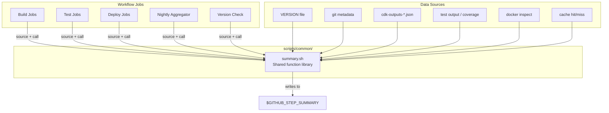

# Design Document: GitHub Actions Job Summaries

## Overview

This design adds rich, visually polished GitHub Actions job summaries (`$GITHUB_STEP_SUMMARY`) across all 10 CI/CD workflows in the AgentCore Public Stack monorepo. Currently, summaries exist only on final deploy jobs and consist of basic metadata plus raw JSON dumps. The nightly and version-check workflows produce no summaries at all.

The approach introduces a shared summary generator script library in `scripts/common/` that each workflow calls to produce standardized, information-dense markdown. Every job type (build, test, deploy, teardown) gets a tailored summary with consistent headers, timing data, collapsible detail sections, and failure diagnostics.

### Design Decisions

1. **Single shared library vs. per-stack scripts**: A single `scripts/common/summary.sh` file with composable functions keeps summaries consistent and avoids duplication across 10 workflows. Stack-specific data is passed as parameters or environment variables.

2. **Shell functions over separate scripts per section**: Rather than one script per summary type, we use a library of bash functions (`write_header`, `write_build_summary`, `write_test_summary`, etc.) that jobs source and call. This keeps the YAML thin while allowing each job to compose exactly the sections it needs.

3. **Timing via `$SECONDS` and step outputs**: GitHub Actions doesn't expose job-level timing natively. We capture `$SECONDS` at the start and end of key phases and pass durations as parameters to the summary functions. This avoids external dependencies.

4. **CDK outputs parsed with `jq`**: All workflows already have `jq` available. We parse CDK output JSON files into markdown tables instead of dumping raw JSON, using the existing `cdk-outputs-*.json` artifact files.

5. **`if: always()` on all summary steps**: Summary generation steps run regardless of job outcome, ensuring failed runs still produce diagnostic output.

## Architecture



### Summary Generation Flow

Each workflow job follows this pattern:

1. **Source the library**: `source scripts/common/summary.sh`
2. **Capture timing**: Record `$SECONDS` at phase boundaries
3. **Call functions**: `write_header`, then job-specific functions (`write_build_summary`, `write_deploy_summary`, etc.)
4. **Append to `$GITHUB_STEP_SUMMARY`**: Each function appends markdown to the summary file

### Workflow Integration Points

| Workflow | Jobs Getting Summaries | Summary Type |
|---|---|---|
| `infrastructure.yml` | build, synth, test, deploy | Header + Deploy (Infrastructure) |
| `app-api.yml` | build-docker, test-python, test-docker, test-cdk, deploy, create-git-tag | Header + Build + Test + Deploy (ECS) |
| `inference-api.yml` | build-docker, test-python, test-docker, test-cdk, deploy | Header + Build + Test + Deploy (AgentCore) |
| `frontend.yml` | build-frontend, test-frontend, test-cdk, deploy-assets | Header + Build + Test + Deploy (CloudFront) |
| `gateway.yml` | build-cdk, test-cdk, deploy-stack, test-gateway | Header + Deploy (Lambda) |
| `rag-ingestion.yml` | build-docker, test-docker, test-cdk, deploy | Header + Build + Test + Deploy (ECS) |
| `sagemaker-fine-tuning.yml` | build, synth, test, deploy | Header + Deploy (SageMaker) |
| `bootstrap-data-seeding.yml` | seed | Header + Deploy (Bootstrap) |
| `nightly.yml` | all jobs + final aggregator | Header + Status Table + Coverage + Smoke + Teardown |
| `version-check.yml` | version-check | Header + Checklist + Remediation |

## Components and Interfaces

### `scripts/common/summary.sh` — Shared Function Library

This is the core component. It exports bash functions that generate markdown sections.

#### Function Signatures

```bash
# Core header — called by every job
# Params: workflow_name, status (success|failure|partial), stack_name
# Reads from env: CDK_PROJECT_PREFIX, CDK_AWS_REGION, GITHUB_* vars
write_header()

# Build summary for Docker workflows
# Params: image_tag, platform, image_size_bytes, ecr_uri, image_digest
# Optional env: CACHE_HIT_PYTHON, CACHE_HIT_NODE
write_build_summary()

# Test summary for Python test jobs
# Params: total, passed, failed, skipped, duration_seconds
# Optional: coverage_percent, failing_test_names (newline-separated, max 10)
write_test_summary_python()

# Test summary for frontend test jobs
# Params: total_suites, total_tests, passed, failed, duration_seconds
# Optional: coverage_percent
write_test_summary_frontend()

# Test summary for CDK validation
# Params: result (pass|fail), resource_count
write_test_summary_cdk()

# Test summary for Docker image tests
# Params: health_check_result (pass|fail), startup_time_seconds
write_test_summary_docker()

# Deploy summary — dispatches to stack-specific formatting
# Params: stack_type (infrastructure|app-api|inference-api|frontend|gateway|rag-ingestion|sagemaker|bootstrap)
# Reads: cdk-outputs-*.json or env vars for stack-specific data
write_deploy_summary()

# Timing footer
# Params: phase_timings (associative array or key=value pairs)
write_timing_footer()

# Failure summary
# Params: step_name, exit_code, log_tail (last 20 lines)
write_failure_summary()

# Collapsible section wrapper
# Params: summary_label, content
write_collapsible()

# CDK outputs as formatted table (replaces raw JSON dump)
# Params: outputs_json_file
write_cdk_outputs_table()

# Nightly aggregator — status table across all jobs
# Params: job_results (array of name|status|duration tuples)
write_nightly_summary()

# Version check summary
# Params: version_bumped (pass|fail), manifests_synced (pass|fail), lockfiles_synced (pass|fail)
# Optional: old_version, new_version
write_version_check_summary()
```

#### Environment Variables Contract

The summary functions read these from the GitHub Actions environment:

| Variable | Source | Used By |
|---|---|---|
| `CDK_PROJECT_PREFIX` | GitHub vars | `write_header` |
| `CDK_AWS_REGION` | GitHub vars | `write_header` |
| `GITHUB_WORKFLOW` | GitHub built-in | `write_header` |
| `GITHUB_SHA` | GitHub built-in | `write_header` |
| `GITHUB_REF_NAME` | GitHub built-in | `write_header` |
| `GITHUB_EVENT_NAME` | GitHub built-in | `write_header` |
| `GITHUB_ACTOR` | GitHub built-in | `write_header` |
| `GITHUB_RUN_ID` | GitHub built-in | `write_header` |
| `IMAGE_TAG` | Job output | `write_build_summary` |

### Workflow YAML Changes

Each workflow's summary steps change from inline markdown to a script call:

```yaml
# Before (inline, deploy-only)
- name: Deployment summary
  if: success()
  run: |
    echo "## App API Deployment Successful ✅" >> $GITHUB_STEP_SUMMARY
    # ... 20+ lines of inline markdown

# After (script-based, every job)
- name: Generate summary
  if: always()
  run: |
    source scripts/common/summary.sh
    write_header "App API" "success" "AppApiStack"
    write_deploy_summary "app-api"
    write_timing_footer "install=${INSTALL_DURATION}" "build=${BUILD_DURATION}" "deploy=${DEPLOY_DURATION}"
```

## Data Models

### Summary Section Schema

Each summary function produces a markdown section. The logical structure:

```
┌─────────────────────────────────────────────┐
│ HEADER                                       │
│ ┌─────────────────────────────────────────┐ │
│ │ Status emoji + Workflow name             │ │
│ │ Environment | Region | Project Prefix    │ │
│ │ Version | Commit SHA | Branch | Message  │ │
│ │ Trigger type | Actor                     │ │
│ │ [workflow_dispatch inputs if present]     │ │
│ └─────────────────────────────────────────┘ │
├─────────────────────────────────────────────┤
│ JOB-SPECIFIC CONTENT                         │
│ (Build / Test / Deploy details)              │
│ Tables, metrics, key-value pairs             │
├─────────────────────────────────────────────┤
│ CDK OUTPUTS (collapsible)                    │
│ <details><summary>Stack Outputs</summary>    │
│   Formatted markdown table                   │
│ </details>                                   │
├─────────────────────────────────────────────┤
│ FAILURE DETAILS (if applicable, collapsible) │
│ <details><summary>Error Details</summary>    │
│   Step name, exit code, log tail             │
│ </details>                                   │
├─────────────────────────────────────────────┤
│ TIMING FOOTER                                │
│ Phase durations + total wall-clock time      │
└─────────────────────────────────────────────┘
```

### CDK Outputs Table Format

Instead of raw JSON, CDK outputs are rendered as:

| Output Key | Value |
|---|---|
| EcsClusterName | `dev-agentcore-cluster` |
| EcsServiceName | `dev-agentcore-app-api` |
| ... | ... |

### Nightly Status Table Format

| Job | Status | Duration |
|---|---|---|
| Install Backend | ✅ Pass | 1m 23s |
| Test Backend | ✅ Pass | 3m 45s |
| Deploy Infrastructure | ✅ Pass | 5m 12s |
| ... | ... | ... |
| **Total** | **✅ All Passed** | **32m 15s** |

### Version Check Checklist Format

| Check | Status | Details |
|---|---|---|
| VERSION bumped | ✅ | `1.2.0` → `1.3.0` |
| Manifests in sync | ✅ | All 3 manifests match |
| Lockfiles in sync | ❌ | `frontend/ai.client/package-lock.json` out of sync |

