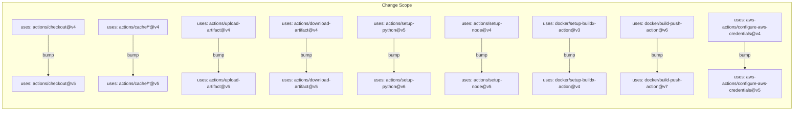

# Design Document: Node.js 24 GitHub Actions Upgrade

## Overview

This feature upgrades all third-party GitHub Actions across 10 workflow files and 1 composite action from Node.js 20-based versions to Node.js 24-compatible versions. The change is a mechanical version-tag bump in YAML `uses:` clauses plus adding the `FORCE_JAVASCRIPT_ACTIONS_TO_NODE24: true` environment variable to each workflow for early opt-in validation.

No application code, shell scripts, CDK stacks, or runtime behavior changes. The workflows remain thin wrappers around `scripts/` — only the action version tags and a single env var are touched.

### Motivation

GitHub will force Node.js 24 as the JavaScript Actions runtime on June 2nd, 2026. Every workflow run currently emits deprecation warnings for actions still on Node.js 20. Upgrading now eliminates warnings and validates compatibility ahead of the deadline.

## Architecture

The change has no architectural impact. The existing workflow architecture (modular, job-centric, artifact-driven, script-based) is preserved exactly. The only modification is the version suffix on `uses:` references and a new top-level `env:` entry.

## Components and Interfaces

### Version Mapping Table

| Action | Current Version | Target Version | Files Affected |
|--------|----------------|----------------|----------------|
| `actions/checkout` | `@v4` | `@v5` | All 10 workflows |
| `actions/cache/save` | `@v4` | `@v5` | infrastructure, inference-api, app-api, frontend, gateway, rag-ingestion, sagemaker-fine-tuning, nightly |
| `actions/cache/restore` | `@v4` | `@v5` | infrastructure, inference-api, app-api, frontend, gateway, rag-ingestion, sagemaker-fine-tuning, nightly |
| `actions/cache` | `@v4` | `@v5` | nightly, gateway |
| `actions/upload-artifact` | `@v4` | `@v5` | infrastructure, inference-api, app-api, frontend, gateway, rag-ingestion, sagemaker-fine-tuning, nightly |
| `actions/download-artifact` | `@v4` | `@v5` | infrastructure, inference-api, app-api, frontend, gateway, rag-ingestion, sagemaker-fine-tuning, nightly |
| `actions/setup-python` | `@v5` | `@v6` | nightly |
| `actions/setup-node` | `@v4` | `@v5` | version-check |
| `docker/setup-buildx-action` | `@v3` | `@v4` | app-api, inference-api, rag-ingestion, nightly |
| `docker/build-push-action` | `@v6` | `@v7` | app-api, inference-api, rag-ingestion |
| `aws-actions/configure-aws-credentials` | `@v4` | `@v5` | composite action (2 occurrences) |

### Files to Modify

**Workflow files** (add `FORCE_JAVASCRIPT_ACTIONS_TO_NODE24: true` to top-level `env:` + bump action versions):
1. `.github/workflows/infrastructure.yml`
2. `.github/workflows/app-api.yml`
3. `.github/workflows/inference-api.yml`
4. `.github/workflows/frontend.yml`
5. `.github/workflows/gateway.yml`
6. `.github/workflows/rag-ingestion.yml`
7. `.github/workflows/sagemaker-fine-tuning.yml`
8. `.github/workflows/nightly.yml`
9. `.github/workflows/version-check.yml`
10. `.github/workflows/bootstrap-data-seeding.yml`

**Composite action** (bump action versions only — no top-level `env:` in composite actions):
11. `.github/actions/configure-aws-credentials/action.yml`

### Constraints

- `version-check.yml`: After upgrading `actions/setup-node@v4` → `@v5`, the `node-version: '22'` parameter must be preserved. The action version controls the Node.js runtime for the action itself; the `node-version` input controls which Node.js is installed for the project.
- Composite actions (`using: 'composite'`) do not support top-level `env:` blocks, so `FORCE_JAVASCRIPT_ACTIONS_TO_NODE24` is only added to the 10 workflow files.
- All `with:` parameters (paths, keys, retention-days, platforms, build-args, etc.) remain unchanged.

## Data Models

No data model changes. This feature modifies only YAML configuration files. The data flowing through workflows (artifacts, caches, Docker images, CDK outputs) is unchanged.

## Correctness Properties

*A property is a characteristic or behavior that should hold true across all valid executions of a system — essentially, a formal statement about what the system should do. Properties serve as the bridge between human-readable specifications and machine-verifiable correctness guarantees.*

### Property 1: Zero deprecated action version references

*For any* YAML file in `.github/workflows/` or `.github/actions/`, the file shall contain zero occurrences of any of the following deprecated version tags: `actions/checkout@v4`, `actions/cache@v4`, `actions/cache/save@v4`, `actions/cache/restore@v4`, `actions/upload-artifact@v4`, `actions/download-artifact@v4`, `actions/setup-python@v5`, `actions/setup-node@v4`, `docker/setup-buildx-action@v3`, `docker/build-push-action@v6`, or `aws-actions/configure-aws-credentials@v4`.

**Validates: Requirements 1.1, 1.2, 1.3, 1.4, 1.5, 1.6, 2.1, 2.2, 3.1, 4.1, 4.2, 4.3, 7.1, 7.2, 7.3, 7.4, 7.5, 7.6**

### Property 2: Node.js 24 opt-in flag present in all workflows

*For any* workflow file in `.github/workflows/`, the top-level `env:` block shall contain the key `FORCE_JAVASCRIPT_ACTIONS_TO_NODE24` set to `true`.

**Validates: Requirements 5.1**

### Property 3: Workflow structure preservation

*For any* workflow file, all YAML content outside of action version tags in `uses:` clauses and the added `FORCE_JAVASCRIPT_ACTIONS_TO_NODE24` env entry shall be identical before and after the upgrade. This includes `on:` triggers, `needs:` dependency chains, `with:` parameters, `concurrency:` groups, `permissions:` declarations, and `environment:` selection logic.

**Validates: Requirements 6.1, 6.2, 6.3, 6.4, 6.5, 6.6, 6.7**

## Error Handling

This feature has minimal error surface since it is a static YAML edit with no runtime logic:

- **Invalid version tag**: If a target version (e.g., `@v5`) does not exist on the action's repository at the time of workflow execution, GitHub Actions will fail the job with a clear "Unable to resolve action" error. Mitigation: verify each target version exists before merging.
- **Breaking API changes**: A major version bump could introduce breaking changes to action inputs/outputs. Mitigation: review each action's release notes for breaking changes. The actions in scope (`actions/checkout`, `actions/cache`, etc.) historically maintain backward compatibility across major versions for core `with:` parameters.
- **Composite action compatibility**: The composite action does not have its own `env:` block, so the `FORCE_JAVASCRIPT_ACTIONS_TO_NODE24` flag propagates from the calling workflow. No special handling needed.

## Testing Strategy

### Verification Approach

Since this is a YAML-only change with no application logic, testing focuses on static validation rather than runtime behavior.

### Unit Tests (specific examples)

- Verify `version-check.yml` still has `node-version: '22'` in the `actions/setup-node` step after upgrade.
- Verify the composite action file has exactly 2 occurrences of `aws-actions/configure-aws-credentials@v5`.
- Verify `bootstrap-data-seeding.yml` (which has no existing top-level `env:` block) correctly receives the `FORCE_JAVASCRIPT_ACTIONS_TO_NODE24: true` entry.

### Property Tests

Property-based testing library: Since the files under test are YAML, a shell-based grep/scan approach or a lightweight YAML parser in Python (using `hypothesis` which is already in the project) is appropriate.

Each property test should run against the full set of 11 target files (10 workflows + 1 composite action) and verify the property holds for every file and every action reference within each file.

- **Property 1 test**: Parse all YAML files, extract every `uses:` value, and assert none match the deprecated version patterns. Minimum 100 iterations not applicable here since the input space is the fixed set of files, but the test should exhaustively check all files.
  - Tag: **Feature: nodejs24-actions-upgrade, Property 1: Zero deprecated action version references**

- **Property 2 test**: Parse all 10 workflow YAML files, extract the top-level `env:` block, and assert `FORCE_JAVASCRIPT_ACTIONS_TO_NODE24: true` is present.
  - Tag: **Feature: nodejs24-actions-upgrade, Property 2: Node.js 24 opt-in flag present in all workflows**

- **Property 3 test**: For each workflow file, compare the pre-upgrade and post-upgrade YAML with version tags and the new env var normalized out, and assert equality.
  - Tag: **Feature: nodejs24-actions-upgrade, Property 3: Workflow structure preservation**

### Dual Testing Note

- Unit tests cover specific edge cases (node-version preservation, composite action occurrence count, env var in files without existing env block).
- Property tests cover universal invariants across all files (no deprecated refs, flag present everywhere, structure preserved).
- Both are complementary: unit tests catch concrete regressions, property tests verify general correctness across the full file set.
