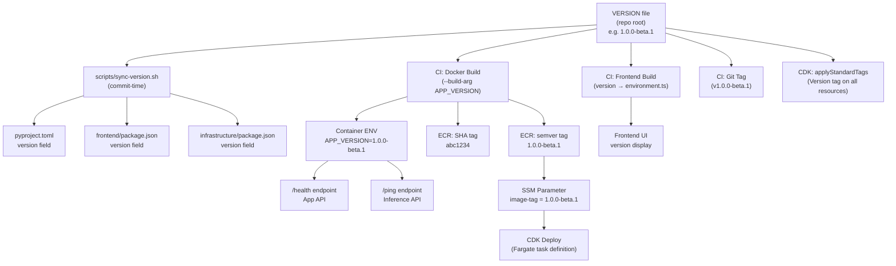
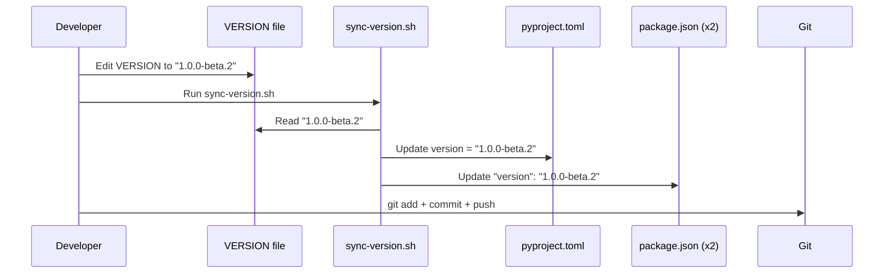
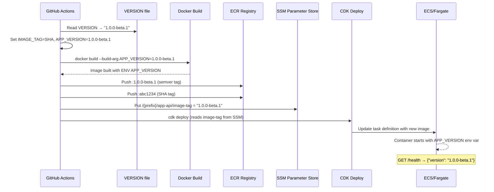
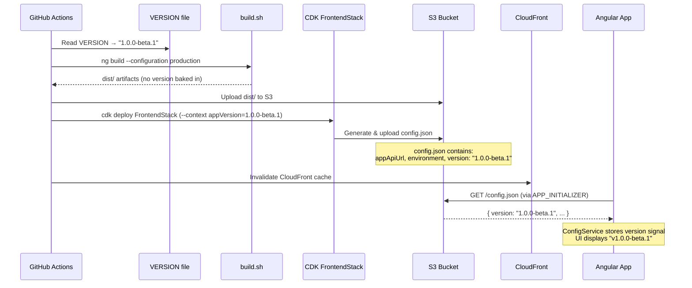
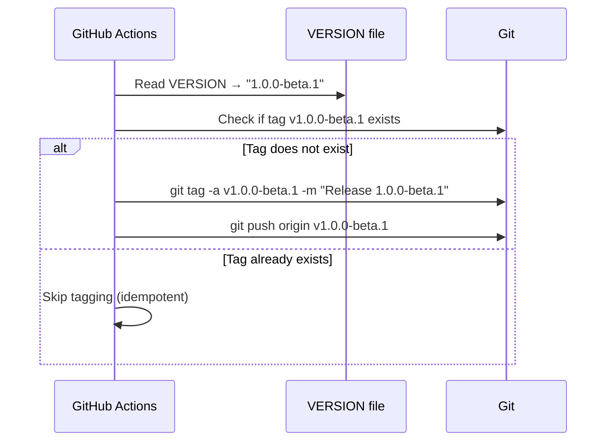

# Design Document: Versioning Strategy

## Overview

This design introduces a unified versioning strategy for the AgentCore Public Stack monorepo ahead of beta launch. Today, version information is fragmented: `pyproject.toml` says `0.1.0`, `package.json` files hold placeholder values, health endpoints return a hardcoded stale `2.0.0`, and Docker images are tagged only with git commit SHAs. There is no CHANGELOG, no VERSION file, and no git tags.

The strategy establishes a single source of truth — a `VERSION` file at the repo root — from which all package manifests, Docker image tags, health endpoints, AWS resource tags, and frontend UI derive their version at build time. The monorepo ships as one product with one version number. Git tags mark releases. Docker images carry both a semver tag and a SHA tag for traceability.

## Architecture

The version flows from a single file through three phases: commit-time sync, CI/CD build-time injection, and runtime exposure.



## Components and Interfaces

### Component 1: VERSION File (Source of Truth)

**Purpose**: Single authoritative location for the monorepo's current version.

**Location**: `VERSION` (repo root)

**Format**: Plain text, single line, semver with optional prerelease suffix.

```
1.0.0-beta.1
```

**Conventions**:
- Follows [SemVer 2.0](https://semver.org/): `MAJOR.MINOR.PATCH[-PRERELEASE]`
- Beta phase uses `X.Y.Z-beta.N` (e.g. `1.0.0-beta.1`, `1.0.0-beta.2`)
- GA release drops the prerelease suffix (e.g. `1.0.0`)
- Bumped manually by a developer via PR — no automated version bumps

**Responsibilities**:
- Holds the canonical version string
- Read by sync script, CI workflows, and build scripts

---

### Component 2: Version Sync Script

**Purpose**: Keeps `pyproject.toml`, `frontend/ai.client/package.json`, and `infrastructure/package.json` version fields in sync with the VERSION file.

**Location**: `scripts/common/sync-version.sh`

**Interface**:
```
Usage: bash scripts/common/sync-version.sh [--check]
  (no flags)  → Writes VERSION value into all package manifests
  --check     → Exits non-zero if any manifest is out of sync (for CI validation)
```

**Responsibilities**:
- Reads `VERSION` file
- Updates `version` field in `backend/pyproject.toml`
- Updates `version` field in `frontend/ai.client/package.json`
- Updates `version` field in `infrastructure/package.json`
- In `--check` mode, reports drift without modifying files (used in CI as a gate)

**Files Modified**:
| File | Field | Method |
|------|-------|--------|
| `backend/pyproject.toml` | `version = "X.Y.Z"` | sed replacement |
| `frontend/ai.client/package.json` | `"version": "X.Y.Z"` | jq or sed |
| `infrastructure/package.json` | `"version": "X.Y.Z"` | jq or sed |

**Note**: Docker images (App API, Inference API, RAG Ingestion) receive the version via `--build-arg` at CI time, not through the sync script. The sync script only handles package manifest files.

---

### Component 3: Backend Health Endpoints (Runtime)

**Purpose**: Expose the running version at runtime via health check responses.

**Current State**:
- App API (`/health`): Returns hardcoded `"version": "2.0.0"`
- Inference API (`/ping`): Returns `{"status": "healthy"}` with no version
- FastAPI app object: `version="2.0.0"` hardcoded in `main.py`

**New Behavior**:
- Both endpoints read version from `APP_VERSION` environment variable
- Falls back to `"unknown"` if env var is not set (local dev without Docker)
- FastAPI app `version` parameter also reads from env var

**Affected Files**:
- `backend/src/apis/app_api/health/health.py`
- `backend/src/apis/inference_api/chat/routes.py` (the `/ping` endpoint)
- `backend/src/apis/inference_api/main.py` (FastAPI app `version` param)
- `backend/src/apis/app_api/main.py` (FastAPI app `version` param, if hardcoded)

---

### Component 4: Docker Build (Build-Time Injection)

**Purpose**: Bake the version into Docker images as an environment variable and apply semver + SHA dual tags.

**Current State**:
- Dockerfiles accept `BUILD_DATE` and `VCS_REF` build args but no version
- Images tagged only with short git SHA
- `tag-latest.sh` adds `latest` and `deployed-<SHA>` tags post-deploy

**New Behavior**:
- Dockerfiles accept a new `APP_VERSION` build arg
- `ENV APP_VERSION=${APP_VERSION}` baked into the image
- CI tags images with both semver (`1.0.0-beta.1`) and SHA (`abc1234`)
- `tag-latest.sh` continues to add `latest` after successful deploy
- ECR lifecycle policy already preserves tags prefixed with `v` and `release`

**Affected Docker images (3 total)**:

| Image | Dockerfile | Health Endpoint | Version Env Var |
|-------|-----------|-----------------|-----------------|
| App API | `Dockerfile.app-api` | `/health` → version in response | `APP_VERSION` |
| Inference API | `Dockerfile.inference-api` | `/ping` → version in response | `APP_VERSION` |
| RAG Ingestion | `Dockerfile.rag-ingestion` | N/A (Lambda, no health endpoint) | `APP_VERSION` (for logging/traceability) |

**Affected Files**:
- `backend/Dockerfile.app-api`
- `backend/Dockerfile.inference-api`
- `backend/Dockerfile.rag-ingestion`
- `scripts/stack-app-api/build.sh`
- `scripts/stack-app-api/push-to-ecr.sh`
- `scripts/stack-inference-api/build.sh`
- `scripts/stack-inference-api/push-to-ecr.sh`
- `scripts/stack-rag-ingestion/push-to-ecr.sh`

**Stacks excluded from Docker versioning (no container images)**:
- **Infrastructure** — Pure CDK resources (VPC, ALB, ECS Cluster). No runtime artifact.
- **Gateway** — AgentCore Gateway + Lambda functions bundled by CDK. No Docker image.
- **Frontend** — Static assets to S3. Version exposed via `config.json` (Component 6).

---

### Component 5: CI/CD Workflows (Orchestration)

**Purpose**: Read VERSION file, pass it through build/push/deploy pipeline, and optionally create git tags.

**Current State**:
- `IMAGE_TAG` is set to `git rev-parse --short HEAD` in the `build-docker` job
- No version validation or git tagging

**New Behavior**:
- New step in `build-docker` job: read VERSION file into `APP_VERSION` output
- Docker build passes `--build-arg APP_VERSION=$APP_VERSION`
- Docker image tagged with both `$APP_VERSION` and `$IMAGE_TAG` (SHA)
- `push-to-ecr.sh` pushes both tags; SSM parameter stores the semver tag
- Version-check job runs `sync-version.sh --check` to catch drift
- On `main` branch push: create git tag `v$APP_VERSION` if it doesn't exist

**Affected Workflows**:
- `.github/workflows/app-api.yml`
- `.github/workflows/inference-api.yml`
- `.github/workflows/rag-ingestion.yml`
- `.github/workflows/frontend.yml`

**Workflows excluded (no version injection needed)**:
- `.github/workflows/infrastructure.yml` — CDK-only, no Docker image or runtime version surface
- `.github/workflows/gateway.yml` — CDK-only, Lambda functions bundled by CDK (no Docker image)

---

### Component 6: Frontend Version Display

**Purpose**: Make the running version visible in the Angular frontend UI.

**Current State**:
- `environment.ts` has no version field (local dev fallback only)
- `ConfigService` loads runtime config from `/config.json` at startup (generated by CDK `FrontendStack`)
- No version displayed anywhere in the UI

**New Behavior**:
- **Deployed builds**: CDK `FrontendStack` reads the version (from CDK context or env var) and includes it in the generated `config.json` alongside `appApiUrl` and `environment`. The `ConfigService` picks it up at startup via `APP_INITIALIZER`.
- **Local dev**: `environment.ts` gets a static fallback `version: 'dev'`. If a local `public/config.json` exists, it can override this.
- `RuntimeConfig` interface in `ConfigService` gains a `version` field.
- Frontend can display version in the sidebar footer, settings page, or header tooltip.

**Affected Files**:
- `frontend/ai.client/src/app/services/config.service.ts` (add `version` to `RuntimeConfig` interface + computed signal)
- `frontend/ai.client/src/environments/environment.ts` (add `version: 'dev'` fallback)
- `frontend/ai.client/src/environments/environment.production.ts` (add `version: ''` fallback)
- `infrastructure/lib/frontend-stack.ts` (add `version` to `runtimeConfig` object)
- `infrastructure/lib/config.ts` (load version from env var / context)

**Config flow (deployed)**:
```
VERSION file → CI env var → CDK context → config.ts → FrontendStack → config.json (S3) → ConfigService → UI
```

**Config flow (local dev)**:
```
environment.ts (version: 'dev') → ConfigService fallback → UI
```

---

### Component 7: AWS Resource Tagging

**Purpose**: Tag all AWS resources across all stacks with the current version for traceability, cost allocation, and audit.

**Current State**:
- `applyStandardTags()` in `config.ts` applies `Project` tag + any tags from `config.tags` to every stack
- Every stack calls `applyStandardTags(this, config)` — so adding a tag here cascades to all AWS resources automatically
- No `Version` tag exists today

**New Behavior**:
- `config.ts` loads the app version from `CDK_APP_VERSION` env var or CDK context (`appVersion`)
- `applyStandardTags()` adds a `Version` tag with the value from the VERSION file (e.g. `1.0.0-beta.1`)
- This applies to all resources in all 7 stacks: Infrastructure, App API, Inference API, Frontend, Gateway, RAG Ingestion, and any future stacks
- No per-stack changes needed — the tag propagates via the existing `applyStandardTags()` call

**Affected Files**:
- `infrastructure/lib/config.ts` (add `appVersion` to `AppConfig`, load from env/context, add to `applyStandardTags`)
- `scripts/common/load-env.sh` (export `CDK_APP_VERSION` from VERSION file)
- All `synth.sh` / `deploy.sh` scripts (pass `--context appVersion=...`)
- All workflow YAML files (read VERSION file, set `CDK_APP_VERSION` env var)

**Tag applied**:
| Tag Key | Tag Value | Example |
|---------|-----------|---------|
| `Version` | `<contents of VERSION file>` | `1.0.0-beta.1` |

**Coverage**: All AWS resources across all stacks (VPC, ALB, ECS, S3, CloudFront, DynamoDB, Lambda, Gateway, etc.)

---

### Component 8: PR Version Gate Workflow

**Purpose**: Block PRs to `main` that haven't bumped the VERSION file or have manifests out of sync.

**Trigger**: All pull requests targeting `main`, regardless of which files changed.

**Checks (both must pass)**:

| Check | What it does | Failure message |
|-------|-------------|-----------------|
| Version bumped | Compares `VERSION` file in the PR branch against `main`. If unchanged, fails. | "VERSION file has not been updated. Bump the version before merging to main." |
| Version synced | Runs `sync-version.sh --check` to verify all manifests match VERSION. | "Package manifests are out of sync with VERSION. Run `bash scripts/common/sync-version.sh` and commit." |

**Workflow**: `.github/workflows/version-check.yml`

**Behavior**:
- Fires on every PR to `main` (all file paths, no path filter)
- Fetches `main` branch to compare VERSION against
- Step 1: `git diff origin/main -- VERSION` — if empty, the version wasn't bumped → fail
- Step 2: `bash scripts/common/sync-version.sh --check` — if non-zero exit, manifests are drifted → fail
- Both steps run so the developer sees all failures at once (not fail-fast on step 1)
- Lightweight: no dependencies to install, no AWS credentials, no Docker — just bash + git

**Branch protection**: Configure `version-check` as a required status check on `main` in GitHub repo settings. This blocks merge until both checks pass.

**Note**: This workflow does NOT run on pushes to `main` or `develop` — it's PR-only. The version bump enforcement only applies to the merge gate into `main`.

---

### Component 9: Git Tags

**Purpose**: Mark release commits with semver tags for traceability and rollback.

**Mechanism**:
- After successful deploy on `main`, CI creates an annotated git tag `v<VERSION>` if it doesn't already exist
- Tags are not created on `develop` or PR branches
- Tags are lightweight pointers — no GitHub Release objects created automatically (can be added later)

**Affected Files**:
- `.github/workflows/app-api.yml` (or a dedicated release workflow)

---

### Component 10: AI Assistant Versioning Guides

**Purpose**: Ensure all AI coding assistants (Claude Code, Cursor, Kiro) know how to bump the version correctly without the developer having to explain it each time.

**Files created (3 total)**:

| File | Tool | Inclusion |
|------|------|-----------|
| `.claude/skills/versioning/SKILL.md` | Claude Code | Auto (skill) |
| `.cursor/rules/versioning.mdc` | Cursor | `alwaysApply: true` |
| `.kiro/steering/versioning.md` | Kiro | Always included (no frontmatter = default) |

**Content** (identical across all three, adapted to each format):

Concise instructions covering:
1. Source of truth is `VERSION` file at repo root
2. Format: `MAJOR.MINOR.PATCH[-PRERELEASE]` (SemVer)
3. To bump: edit `VERSION`, run `bash scripts/common/sync-version.sh`, commit both
4. PRs to `main` will fail if VERSION isn't bumped or manifests are out of sync
5. CI handles everything else (Docker tags, AWS resource tags, health endpoints, frontend, git tags)

**Key constraint**: Keep each file under ~20 lines of content. The guides should be a quick reference, not a tutorial.

## Data Models

### VERSION File Format

```
MAJOR.MINOR.PATCH[-PRERELEASE]
```

Examples:
- `1.0.0-beta.1` (first beta)
- `1.0.0-beta.2` (second beta)
- `1.0.0` (GA release)
- `1.1.0` (minor feature release)

**Validation Rules**:
- Must match regex: `^[0-9]+\.[0-9]+\.[0-9]+(-[a-zA-Z0-9.]+)?$`
- No leading `v` prefix (the `v` is added only in git tags)
- No trailing newline beyond the single line
- File must contain exactly one line

### Health Endpoint Response (App API)

```json
{
  "status": "healthy",
  "service": "agent-core",
  "version": "1.0.0-beta.1"
}
```

### Health Endpoint Response (Inference API)

```json
{
  "status": "healthy",
  "version": "1.0.0-beta.1"
}
```

### SSM Parameter

| Parameter | Value | Description |
|-----------|-------|-------------|
| `/{prefix}/app-api/image-tag` | `1.0.0-beta.1` | Semver tag (was SHA) |
| `/{prefix}/inference-api/image-tag` | `1.0.0-beta.1` | Semver tag (was SHA) |

### ECR Image Tags (per image)

| Tag | Purpose | Example |
|-----|---------|---------|
| Semver | Release identification | `1.0.0-beta.1` |
| SHA | Commit traceability | `abc1234` |
| `latest` | Current deployed (post-deploy) | `latest` |
| `deployed-<SHA>` | Lifecycle policy protection | `deployed-abc1234` |


## Sequence Diagrams

### Version Flow: Developer Bumps Version



### Version Flow: CI/CD Pipeline (App API)



### Version Flow: Frontend Build & Deploy



### Version Flow: Git Tagging (on main)



## Error Handling

### Error Scenario 1: VERSION File Missing or Malformed

**Condition**: VERSION file doesn't exist, is empty, or doesn't match semver regex.
**Response**: `sync-version.sh` and CI workflows exit with non-zero code and a clear error message.
**Recovery**: Developer creates or fixes the VERSION file and re-runs.

### Error Scenario 2: Package Manifests Out of Sync

**Condition**: `sync-version.sh --check` detects that a manifest's version doesn't match VERSION.
**Response**: CI version-check job fails, blocking the pipeline.
**Recovery**: Developer runs `sync-version.sh` locally, commits the updated manifests.

### Error Scenario 3: APP_VERSION Env Var Not Set at Runtime

**Condition**: Container starts without `APP_VERSION` (e.g., local dev without Docker build args).
**Response**: Health endpoints return `"version": "unknown"`. Application runs normally.
**Recovery**: No action needed — this is expected in local development.

### Error Scenario 4: Git Tag Already Exists

**Condition**: CI tries to create a tag that already exists (re-run of same version).
**Response**: Tagging step is idempotent — skips if tag exists.
**Recovery**: No action needed.

### Error Scenario 5: ECR Push Fails for Semver Tag

**Condition**: Network error or permissions issue pushing the semver-tagged image.
**Response**: CI job fails. SHA-tagged image may or may not have been pushed.
**Recovery**: Re-run the workflow. ECR push is idempotent for the same digest.

## Testing Strategy

### Unit Testing Approach

- Health endpoint tests: verify response includes `version` field read from env var
- `sync-version.sh --check`: test with matching and mismatched versions
- VERSION file validation: test regex against valid and invalid strings

### Integration Testing Approach

- Docker build test: build image with `--build-arg APP_VERSION=test-1.0.0`, run container, curl `/health`, assert version matches
- Existing `test-docker.sh` scripts already test health endpoints — extend to verify version field
- Frontend build test: run build with `APP_VERSION` set, verify `environment.ts` contains injected version

## Performance Considerations

No performance impact. Version reading happens once at build time (Docker `ENV`) or once at startup (reading env var). Health endpoints already exist and add no new overhead.

## Security Considerations

- VERSION file contains no secrets — safe to commit
- `APP_VERSION` env var is non-sensitive — no need for Secrets Manager
- Git tags are created by CI with existing `GITHUB_TOKEN` permissions (requires `contents: write`)

## Dependencies

- **Existing**: jq (already available in CI runners and load-env.sh), sed, git
- **No new external dependencies** — this feature uses only shell scripts, Docker build args, and environment variables
- **ECR lifecycle policy**: Already preserves tags prefixed with `v` — semver tags like `1.0.0-beta.1` need the existing `release` prefix rule or a new numeric prefix rule added
